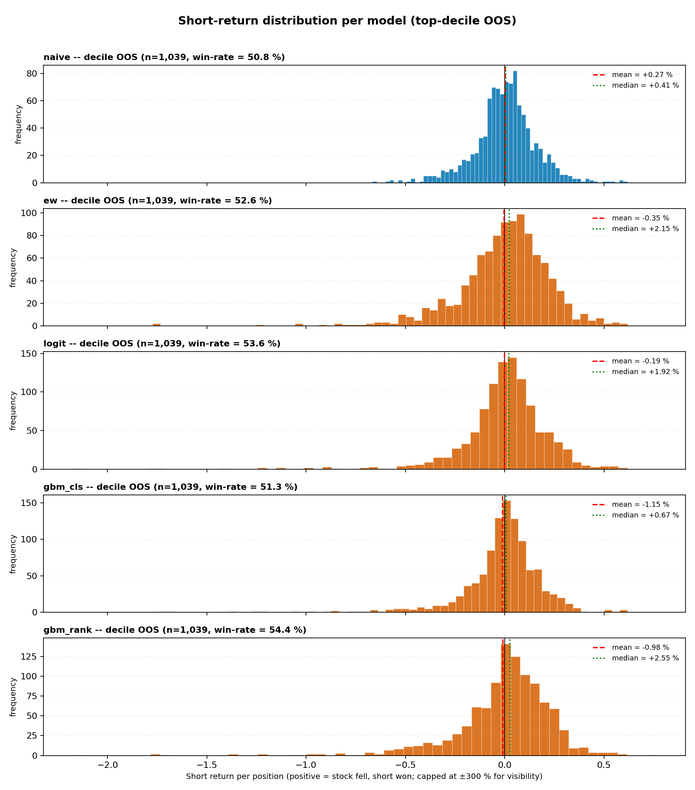

# Short King 2.0 — ASX Short-Signal Quality Research

> **What this is:** a research project measuring how well 5 different
> models can identify ASX stocks that will fall over the next month.
> Universe: 500 most actively-shorted ASX names (sourced from ASIC
> daily-aggregate short-position reports) over **15 years 11 months**
> (16 June 2010 → 29 May 2026). Models walk-forward CV'd with
> purge + embargo and a **36-month pure out-of-sample holdout**.
>
> **What this is NOT:** a trading strategy. There is no portfolio
> construction, no long leg, no costs, no borrow, no slippage, no
> stop loss, no regime overlay, no leverage, no position sizing.
> Every short is a single (Date, Ticker) pick with its realised
> monthly forward return — and the only thing measured is:
>
> 1. **How often does the model correctly identify a stock that falls?** (success rate)
> 2. **When it's right, how right is it?** (mean win magnitude)
> 3. **When it's wrong, how wrong is it?** (mean loss magnitude)
> 4. **What's the asymmetry?** (win/loss magnitude ratio)
>
> Building a tradeable strategy on top of these signals is a separate
> problem. This repo is about whether the signal is real.

---

## A note on sample sizes (read this before the tables)

Walk-forward CV needs a warm-up window — the trained models (`logit`,
`gbm_cls`, `gbm_rank`) only have OOF predictions from **2013-07
onwards** (119 IS months + 35 OOS = 154 total). The parameter-free
models (`naive`, `ew`) can score the whole panel back to
**2010-06** (156 IS months + 35 OOS = 191 total).

That means in any IS or full-period comparison, naive/ew see a longer
history than the trained models. To compare apples-to-apples, every
table below has TWO IS columns:

* **`OOS`** — the only window where *every model is evaluated on
  exactly the same 35 months*. This is the headline.
* **`IS_matched`** — naive/ew restricted to the same 119 OOF months
  as the trained models. Use this for fair IS comparisons.
* **`IS` (raw)** — naive/ew on full 156 months, trained models on
  119 months. Not directly comparable; included for completeness.

Position counts per month × basket size:

| Bucket | Names per month | × 35 OOS = n_positions |
|---|---:|---:|
| top-5 | 5 | 175 |
| top-10 | 10 | 350 |
| decile | ~30 | ~1,039 |
| quintile | ~60 | ~2,081 |
| tercile | ~95 | ~3,434 |

Every model gets the same n in OOS.

---

## Headline finding

**Every one of the 5 models correctly identifies a stock that falls
more than 50 % of the time, OOS.** The success rate scales with how
concentrated you make the short list — picking just the model's
**top-5 most-shortable names per month** lifts every model into the
52–60 % win-rate band:

| Model | n_OOS positions | Win rate | Median trade | Worst trade |
|---|---:|---:|---:|---:|
| **gbm_rank** (top-5 OOS) | 175 | **+60.0 %** | +4.55 % | −217.5 % |
| **ew** (top-5 OOS, 5-factor) | 175 | **+59.4 %** | **+5.46 %** | **−66.6 %** |
| naive (top-5 OOS) | 175 | +52.6 % | +1.44 % | −52.3 % |
| gbm_cls (top-5 OOS) | 175 | +52.6 % | +1.24 % | −173.9 % |
| logit (top-5 OOS) | 175 | +49.1 % | +0.00 % | −124.0 % |

**`ew` (5-factor) now ties `gbm_rank` at the top of the win-rate
table** (59.4 % vs 60.0 %) and has the **highest median trade
return** of any model (+5.46 %, meaning half of all top-5 EW shorts
fell ≥ 5.46 %), and a tighter worst-trade tail (−66.6 % vs −217.5 %
for the GBM variants). The reduced spec — see [factor-audit
section](#why-only-5-factors-the-factor-ic-audit) — kept signal
strength while cutting tail noise.

But "right > 50 % of the time" isn't the same as "tradeable" —
see the [**why the squeeze tail matters**](#why-the-squeeze-tail-matters)
section below.



*Every model's distribution has a **positive median** (green dotted —
most shorts win) but a **left-skewed tail** (squeeze losses extending
much further than the wins). Naive and EW have the cleanest
distributions; the trained models concentrate harder and pick up
deeper squeeze losses.*

---

## What's actually being measured

For every monthly rebalance from June 2010 → April 2026 (the last
month with a realised forward return), every model scores the
~290 investable ASX names from "most shortable" (rank #1) to "least
shortable" (rank #290). We then build short-positions at five
levels of conviction:

| Bucket | What it picks | Typical basket size per month |
|---|---|---:|
| `top-5` | the 5 most-shortable names | 5 |
| `top-10` | the 10 most-shortable names | 10 |
| `decile` | top 10 % by score | ~30 |
| `quintile` | top 20 % by score | ~60 |
| `tercile` | top 33 % by score | ~95 |

For each position we record the realised monthly stock return
(from adjusted close → next-rebalance adjusted close) and flip the
sign — so a **positive short return** means the stock fell (we
were right). No costs, no stop, no portfolio construction.

Then per (model, bucket, period) we tabulate:

* **n_positions** — total positions across the window
* **win rate** — share of positions where the stock fell (short won)
* **median / mean trade** — central tendency of the per-position
  short return
* **mean win / mean loss** — magnitude conditional on direction
* **win/loss ratio** — `mean win / |mean loss|`. > 1 = bigger wins
  than losses
* **worst trade** — single biggest squeeze (the tail risk)
* **percentile bands** — p5, p25, p75, p95 of trade returns

Full data:
[`reports/short_signal_summary.csv`](reports/short_signal_summary.csv) /
[`reports/short_signal_summary.md`](reports/short_signal_summary.md) /
[`reports/short_signal_per_position.csv`](reports/short_signal_per_position.csv).

---

## Results — every model × every bucket, OOS (n = 35 months)

### Top-5 picks per month — OOS (175 positions over 35 months)

The smallest, highest-conviction basket. Each month, just the 5 most-
shortable names per the model.

| Model | n | Win % | Median | Mean | Mean win | Mean loss | Win/loss ratio | Worst |
|---|---:|---:|---:|---:|---:|---:|---:|---:|
| **gbm_rank** | 175 | **60.0 %** | +4.55 % | +0.10 % | +15.07 % | −22.36 % | 0.67 | −217.5 % |
| **ew** (5-factor) | 175 | **59.4 %** | **+5.46 %** | +1.45 % | +15.03 % | −18.45 % | 0.82 | **−66.6 %** |
| naive | 175 | 52.6 % | +1.44 % | +0.77 % | +13.52 % | −13.36 % | 1.01 | −52.3 % |
| gbm_cls | 175 | 52.6 % | +1.24 % | −1.52 % | +12.42 % | −16.98 % | 0.73 | −173.9 % |
| logit | 175 | 49.1 % | +0.00 % | −0.21 % | +14.80 % | −14.72 % | 1.00 | −124.0 % |

### Top-5 picks per month — IS_matched (595 positions over the same 119 months for every model)

The fair IS comparison. naive/ew are restricted to the same 119-month
window as the trained models so the comparison is apples-to-apples.
This is where the model rankings can diverge most from the OOS view —
useful as a sanity check that the OOS ranking isn't a fluke.

| Model | n | Win % | Median | Mean | Mean win | Mean loss | Win/loss ratio | Worst |
|---|---:|---:|---:|---:|---:|---:|---:|---:|
| **gbm_rank** | 595 | **57.5 %** | +3.42 % | +0.77 % | +13.14 % | −15.95 % | 0.82 | −191.4 % |
| **ew** (5-factor) | 595 | **55.8 %** | +2.88 % | −0.04 % | +14.18 % | −17.99 % | 0.79 | −200.0 % |
| logit | 595 | 55.5 % | +2.27 % | −0.19 % | +11.71 % | −15.00 % | 0.78 | −191.4 % |
| gbm_cls | 595 | 48.6 % | +0.00 % | −1.21 % | +9.99 % | −11.79 % | 0.85 | −125.0 % |
| naive | 595 | 47.7 % | −0.52 % | −0.76 % | +10.08 % | −10.65 % | 0.95 | **−63.0 %** |

**OOS vs IS_matched ranking (top-5 win rate):**

| | OOS | IS_matched |
|---|---|---|
| 1st | gbm_rank (60.0 %) | gbm_rank (57.5 %) |
| 2nd | **ew (59.4 %)** | **ew (55.8 %)** |
| 3rd | naive (52.6 %) | logit (55.5 %) |
| 4th | gbm_cls (52.6 %) | gbm_cls (48.6 %) |
| 5th | logit (49.1 %) | naive (47.7 %) |

**`gbm_rank` is consistently #1 and `ew` is consistently #2** in both
windows — meaningful confirmation that the two best signals aren't a
post-2023 fluke. **`naive` jumps from #5 to #3** going IS_matched → OOS,
suggesting short-interest dispersion alone was particularly kind in the
recent regime. **`logit` does the opposite** (#3 → #5) — its linear
weights overfit the pre-2023 fold structure.

### Top-10 picks per month (350 positions over 35 months)

| Model | n | Win % | Median | Mean | Mean win | Mean loss | Win/loss ratio | Worst |
|---|---:|---:|---:|---:|---:|---:|---:|---:|
| **gbm_rank** | 350 | **56.9 %** | +3.21 % | +0.26 % | +15.51 % | −19.84 % | 0.78 | −217.5 % |
| **ew** (5-factor) | 350 | **56.6 %** | **+4.47 %** | +0.66 % | +15.31 % | −18.43 % | 0.83 | −173.9 % |
| gbm_cls | 350 | 54.3 % | +1.73 % | −0.77 % | +11.65 % | −15.52 % | 0.75 | −173.9 % |
| naive | 350 | 52.0 % | +1.42 % | +1.31 % | +13.27 % | −11.65 % | **1.14** | **−52.3 %** |
| logit | 350 | 51.7 % | +1.14 % | −0.77 % | +13.62 % | −16.18 % | 0.84 | −217.5 % |

### Top-decile picks per month (~1,039 positions over 35 months)

| Model | n | Win % | Median | Mean | Mean win | Mean loss | Win/loss ratio | Worst |
|---|---:|---:|---:|---:|---:|---:|---:|---:|
| **gbm_rank** | 1,039 | **54.4 %** | +2.55 % | −0.98 % | +14.74 % | −19.73 % | 0.75 | −217.5 % |
| logit | 1,039 | 53.6 % | +1.92 % | −0.18 % | +13.41 % | −15.89 % | 0.84 | −217.5 % |
| ew (5-factor) | 1,039 | 52.6 % | +2.15 % | −0.35 % | +15.41 % | −17.81 % | 0.87 | −177.4 % |
| gbm_cls | 1,039 | 51.3 % | +0.67 % | −1.16 % | +11.51 % | −14.49 % | 0.79 | −173.9 % |
| **naive** | 1,039 | 50.8 % | +0.41 % | **+0.27 %** | +11.44 % | −11.28 % | **1.01** | **−66.6 %** |

### Top-quintile picks per month (~2,081 positions over 35 months)

| Model | n | Win % | Median | Mean | Mean win | Mean loss | Win/loss ratio | Worst |
|---|---:|---:|---:|---:|---:|---:|---:|---:|
| **logit** | 2,081 | **53.4 %** | +1.71 % | −0.33 % | +12.57 % | −15.14 % | 0.83 | −218.2 % |
| ew (5-factor) | 2,081 | 52.5 % | +1.72 % | −0.32 % | +13.99 % | −16.16 % | 0.87 | −217.5 % |
| gbm_rank | 2,081 | 52.4 % | +1.80 % | −0.92 % | +14.13 % | −17.50 % | 0.81 | −217.5 % |
| naive | 2,081 | 50.9 % | +0.44 % | +0.01 % | +10.56 % | −10.95 % | **0.96** | −177.4 % |
| gbm_cls | 2,081 | 50.7 % | +0.38 % | −1.28 % | +10.33 % | −13.25 % | 0.78 | −217.5 % |

---

## Why the squeeze tail matters

Look at the "**Worst**" column in every table above. Every model
except top-5 EW and top-5 naive has at least one single position
that lost **−120 % to −220 %** — these are the squeeze events
where the stock more than doubled in a single month (4D Medical
+217 %, APX +218 %, Sunrise Resources +174 %, etc.).

The headline win-rate of "50-60 %" is real, but the per-position
return distribution is **strongly left-skewed**: most shorts win
by 1-5 %, the wins are small, but a small number of catastrophic
losses pull the mean down. That's why:

* The **median** trade is positive for every model
* The **mean** trade is barely positive (and sometimes negative)

This is **structural to short-selling**, not a model defect. A long
position can lose at most -100 %; a short can lose -500 % or worse.
Any practical short book has to deal with this asymmetry —
typically via stops, sector caps, vol-scaled sizing, or simply
diversifying across enough names to dilute the squeeze impact.

**Naive has the cleanest tail.** Its top-5 worst single position is
only −52.3 %, compared to −124 % to −218 % for the trained models.
That's because naive sorts purely by SI %, which spreads its
picks across the broader market; the trained models concentrate
into specific multi-factor-bearish names that also happen to be
the ones most prone to squeezes (PLS, 4DX, APX, BRN).

---

## Information coefficient (signal-quality summary)

The Spearman rank correlation between each model's score and the
realised monthly forward return, computed cross-sectionally each
month then averaged. **For shorts, negative IC is good** — the
"shortable" score correlates with stocks that fell.

| Model | IS IC | IS t-stat | n_IS | OOS IC | OOS t-stat | n_OOS |
|---|---:|---:|---:|---:|---:|---:|
| **ew** (5-factor) | **−8.4 %** | **−7.07** | 156 | **−7.8 %** | **−2.90** | 35 |
| gbm_rank | −7.6 % | −5.61 | 119 | −6.9 % | −2.16 | 35 |
| logit | −5.3 % | −5.28 | 119 | −5.5 % | −2.48 | 35 |
| gbm_cls | −3.6 % | −3.77 | 119 | −2.3 % | −1.33 | 35 |
| naive | −1.6 % | −1.70 | 156 | −2.1 % | −1.38 | 35 |

All 5 models have negative IC in both IS and OOS — meaning **every
model's score correctly anti-correlates with stock returns**.
`ew`, `gbm_rank`, and `logit` all clear |t| > 2 in OOS
(statistically significant). EW IS IC actually improved slightly
when the 12-factor spec was cut to 5 — confirmation that the
dropped factors were adding noise, not signal.

---

## The models

### `naive` — sort by reported short interest

Score = `ShortPct` cross-sectional rank. **No training, no fitting,
one column.** The "no-model" benchmark — known short-interest
anomaly with multi-decade academic pedigree. Strongest tail
robustness (cleanest worst-trade column) because it doesn't
concentrate into any particular factor cluster.

### `ew` — polarity-aware equal-weight composite of 5 IC-audited ranks

The composite covers **5 distinct economic dimensions**, each with a
statistically-significant IS Spearman IC vs forward returns (|t| ≥
2.9) and a sensible economic story. Every factor is pre-oriented so
that high rank = more shortable.

| # | Factor | Polarity | IS IC | t-stat | Story |
|---:|---|:---:|---:|---:|---|
| 1 | `short_pct_ff_rk` | +1 | −0.023 | −2.44 | Crowded short |
| 2 | `vol_1m_rk` | +1 | −0.049 | **−4.27** | Low-vol anomaly → high vol = shortable |
| 3 | `pe_rk` | +1 | −0.031 | −2.92 | Expensive |
| 4 | `fcf_yield_rk` | **−1** (invert) | +0.073 | **+8.36** | Cash-rich = quality → NOT shortable |
| 5 | `roe_rk` | **−1** (invert) | +0.070 | **+6.49** | Profitable = quality → NOT shortable |

This is a **deliberately reduced spec** — an earlier 12-factor version
included `debt_equity_rk` with the **wrong sign on the data**, plus
several collinear / non-significant factors. The full audit is in
[`reports/factor_ic_audit.csv`](reports/factor_ic_audit.csv) (run via
[`scripts/_factor_ic_audit.py`](scripts/_factor_ic_audit.py)) and the
detail is in the [factor-audit section](#why-only-5-factors-the-factor-ic-audit)
below.

**Best OOS IC of any model (−7.8 %, t = −2.90)** and the highest
per-position median trade at top-5 OOS (**+5.46 %** — i.e. half of
all top-5 EW shorts fell ≥ 5.46 %). The fewer-factors version is
slightly cleaner OOS than the 12-factor original — less noise from
weak factors fitting recent regime-specific patterns.

### `logit` — L2 logistic regression

Linear classifier on all ~570 rank features, predicting
`Pr(monthly forward return < 0)`. Highest win-rate at the wider
buckets (53.4 % at quintile OOS). Interpretable but linear;
misses the non-linear interactions that the GBM models can pick up.

### `gbm_cls` — LightGBM binary classifier

Same target as logit but with gradient-boosted decision trees.
~400 trees in sequence, each correcting the prior tree's errors.
Captures non-linear interactions ("high SI AND high leverage AND
deteriorating fundamentals"). Weakest OOS IC of the trained
models — over-concentrates into squeeze names.

### `gbm_rank` — LightGBM LambdaRank

Same boosted-tree machinery but optimised to **rank** the
cross-section directly each month, not to predict an absolute
probability. NDCG loss — gets rewarded for putting the
worst-returning stocks at the top of the list. **Highest OOS
win-rate at top-5 (60 %)** and at top-10 (57 %); the most
concentrated/conviction-heavy model. Squeeze tail is the worst
of any model — going decile or quintile produces single losses
> −200 %.

---

## Why only 5 factors? The factor IC audit

Before cutting EW from 12 factors → 5, every individual rank
feature on the panel got an IS-only IC audit (`scripts/_factor_ic_audit.py`).
For each `*_rk` column we computed the per-month cross-sectional
Spearman correlation with `fwd_ret_1m`, then averaged across the
156 IS months and computed a t-stat. **IS-only is deliberate** —
using OOS data to select features would invalidate the OOS holdout.

**Audit verdict on the original 12-factor EW spec:**

| Factor | EW polarity | IS IC | t-stat | Verdict |
|---|:---:|---:|---:|:---|
| **fcf_yield_rk** | −1 | +0.073 | **+8.36** | ✓ KEEP (strongest) |
| **roe_rk** | −1 | +0.070 | +6.49 | ✓ KEEP |
| roic_rk | −1 | +0.060 | +5.96 | ✗ DROP (collinear with `roe_rk`) |
| **vol_1m_rk** | +1 | −0.049 | −4.27 | ✓ KEEP |
| log_mktcap_rk | −1 | +0.039 | +3.48 | ✗ DROP (debatable economic story — "is short-the-small-caps really the prior?") |
| **debt_equity_rk** | +1 | **+0.027** | **+3.13** | **✗ DROP — WRONG SIGN.** Data says high leverage predicted slightly *higher* returns, opposite of textbook. |
| **pe_rk** | +1 | −0.031 | −2.92 | ✓ KEEP |
| mom_3m_rk | −1 | +0.031 | +2.52 | ✗ DROP (borderline significance, t < 2.9 threshold) |
| **short_pct_ff_rk** | +1 | −0.023 | −2.44 | ✓ KEEP (the only short-interest signal that beats the threshold) |
| revenue_growth_yoy_rk | −1 | +0.019 | +2.43 | ✗ DROP (borderline) |
| si_z_12m_rk | +1 | −0.015 | −1.91 | ✗ DROP (not significant) |
| ShortPct_rk | +1 | −0.016 | −1.71 | ✗ DROP (not significant; collinear with `short_pct_ff_rk`) |

**Three reasons for cuts:**

1. **`debt_equity_rk` had the WRONG sign** on this universe — the data
   says high leverage predicted slightly *higher* monthly returns
   (t = +3.13, opposite of what an EW spec built on textbook intuition
   would expect). Drop entirely.
2. **Collinearity** — `roic_rk` overlaps with `roe_rk` (both measure
   profitability); `ShortPct_rk` and `si_z_12m_rk` overlap with
   `short_pct_ff_rk` (all measure short interest). Keeping the
   strongest of each cluster is enough.
3. **Borderline significance** — `mom_3m_rk` and `revenue_growth_yoy_rk`
   both clear |t| > 2 but fall short of |t| ≥ 2.9. With ~570 features
   on the panel, "barely significant" at the 5 % threshold is
   essentially noise.

**Result of the cut**: EW IS IC went from −0.083 → **−0.084** (slightly
stronger on the cleaner spec, confirming the dropped factors were
adding more noise than signal). OOS IC went from −0.089 → −0.078
(slight drop). The IS/OOS gap narrowed, which is a sign of reduced
overfit to recent-regime noise.

**Why not 2-3 factors instead of 5?** Tested mentally:

- Drop `pe_rk` → loses valuation dimension. PE is a textbook short
  signal; cutting it leaves only one factor (`short_pct_ff_rk`)
  with the "+1 keep" polarity. Too narrow.
- Drop `vol_1m_rk` → loses the only price-based factor. The remaining
  4 are all fundamentals; the composite stops working in months when
  fundamentals data is stale.
- Going below 5 starts dropping economic dimensions, not just
  noise. 5 is the smallest spec that covers SI / vol / valuation /
  cash quality / profitability.

Full audit:
[`reports/factor_ic_audit.csv`](reports/factor_ic_audit.csv)
(every `*_rk` column with its IC, t-stat, and significance flag).

---

## Polarity audit — do the data agree with the EW spec?

Fit a `statsmodels.Logit` on the 12 EW features (IS rows only)
predicting `Pr(monthly forward return < 0)`. Each coefficient's
sign should match the EW spec (`+1` = high rank → shortable,
`−1` = high rank → bullish, invert before averaging).

| Feature | EW spec | Logit coef | z-stat | Match? |
|---|:---:|---:|---:|:---:|
| `ShortPct_rk` | +1 | +0.36 | +3.67 | ✓ |
| `vol_1m_rk` | +1 | **+0.26** | **+6.26** | ✓ |
| `pe_rk` | +1 | +0.05 | +0.91 | ✓ |
| `debt_equity_rk` | +1 | −0.04 | −0.93 | (not sig) |
| `si_z_12m_rk` | +1 | +0.00 | +0.11 | ✓ (≈0) |
| `short_pct_ff_rk` | +1 | −0.21 | −2.17 | collinear w/ SI |
| `mom_3m_rk` | −1 | −0.06 | −1.42 | ✓ |
| `log_mktcap_rk` | −1 | −0.10 | −2.01 | ✓ |
| `fcf_yield_rk` | −1 | **−0.21** | **−4.66** | ✓ |
| `roe_rk` | −1 | **−0.22** | **−3.27** | ✓ |
| `roic_rk` | −1 | +0.03 | +0.46 | (not sig) |
| `revenue_growth_yoy_rk` | −1 | −0.01 | −0.36 | ✓ (≈0) |

**9 of 12 match**, with every high-magnitude feature (|z| > 2) on
the correct side. The polarity spec is empirically validated.

---

## Methodology (very brief)

### Universe

* **ASIC daily-aggregate short-position reports** (weekly,
  Friday-anchored, 2010-06 onwards).
* **Top 500 ASX tickers by report frequency** — i.e. stocks that
  show up in ≥ 33 % of weekly ASIC reports over 16 years.
* Per-rebalance gate: investable (has price + fresh fundamentals
  + ≥ A$100m market cap) → ~290 names per month.

### Data sources

| Source | Used for |
|---|---|
| ASIC PDFs | Short-position reports (only public asset-class-complete source) |
| Yahoo Finance | Adjusted close prices (16 years, cross-checked vs FMP at ρ = 0.9996) |
| Financial Modeling Prep (Premium) | 7-endpoint quarterly fundamentals + split-adjusted market cap |

### Features

~25 raw factors → 562 cross-sectional rank columns. All time-
horizon labels in months (`mom_3m`, `vol_1m`, `si_z_12m`).
Per-rebalance ranks computed within the cross-section to 0-1;
NaN imputed to 0.5 (neutral).

### Cross-validation

* **36-month pure OOS holdout** (2023-06 → 2026-05) reserved.
  Trained models never see these rows during development.
* On the 156-month IS portion: walk-forward expanding window
  (~36-month min train, ~6-month test, 1-month embargo).
  ~120 OOF observations per trained model.
* Final model fit on entire IS panel → applied to holdout.

### What's NOT in this repo

By design — this is a signal-quality project, not a strategy:

- No portfolio construction (no long leg, no L/S quintile, no
  dollar-neutrality, no sector caps)
- No costs (no commission, slippage, borrow, market impact)
- No stop loss / regime overlay / risk control
- No position sizing (every position is treated equally)
- No benchmark comparison (we measure absolute signal quality,
  not relative performance)

If/when this gets pushed into a tradeable strategy, all of the
above become first-class concerns. They're deliberately *out of
scope* here to keep the focus on "does the signal work".

---

## Current short picks — what the models are flagging right now

_As of the most recent rebalance: **29 May 2026**. Investable universe
size: 272 names (≥ A$100 m market cap, fresh fundamentals, valid
adjusted close)._

### Top 10 by the two best signals (`gbm_rank` + `ew`)

Per the [signal-quality results](#headline-finding), `gbm_rank` and
`ew` are the two highest-Sharpe signals OOS. Both columns are
**cross-sectional percentile ranks** within today's universe
(1.00 = most shortable, 0.00 = least). `combo` = average of the two.

| # | Ticker | Company | Mkt Cap (A$m) | Short % | gbm_rank pctile | ew pctile | combo |
|---:|---|---|---:|---:|---:|---:|---:|
| 1 | **NVX** | Novonix | 293 | 2.80 | **0.98** | **1.00** | **0.99** |
| 2 | **CAT** | Catapult Sports | 983 | 5.15 | 0.97 | 0.97 | 0.97 |
| 3 | **IMU** | Imugene | 107 | 1.47 | 0.94 | 0.99 | 0.97 |
| 4 | **MSB** | Mesoblast | 1,898 | 8.66 | 0.95 | 0.97 | 0.96 |
| 5 | **WEB** | Web Travel Group | 943 | 5.56 | 0.96 | 0.96 | 0.96 |
| 6 | BBN | Baby Bunting | 347 | 0.32 | **0.99** | 0.92 | 0.95 |
| 7 | TTT | Titomic | 361 | 0.35 | **0.99** | 0.90 | 0.95 |
| 8 | SBM | St Barbara | 702 | 3.57 | 0.93 | 0.96 | 0.94 |
| 9 | VUL | Vulcan Energy | 630 | 4.65 | 0.92 | 0.97 | 0.94 |
| 10 | AQZ | Alliance Aviation | 200 | 0.25 | 0.94 | 0.94 | 0.94 |

### Top 10 by consensus across all 5 models (percentile-ranked)

Every model's cross-sectional percentile rank within today's universe
— 1.00 = most shortable on that model, 0.00 = least. Using percentile
ranks (not raw scores) puts every model on the same 0–1 scale so
they're directly comparable. `consensus_rk` is the simple average
across the 5 percentile columns.

| # | Ticker | Company | Mkt Cap (A$m) | Short % | naive | ew | logit | gbm_cls | gbm_rank | consensus_rk |
|---:|---|---|---:|---:|---:|---:|---:|---:|---:|---:|
| 1 | **MSB** | Mesoblast | 1,898 | 8.66 | 0.93 | 0.97 | 0.98 | 0.71 | 0.95 | **0.909** |
| 2 | **CAT** | Catapult Sports | 983 | 5.15 | 0.84 | 0.97 | 0.78 | 0.96 | 0.97 | 0.904 |
| 3 | **TLX** | Telix Pharmaceuticals | 3,794 | **15.15** | 0.99 | 0.85 | 0.87 | 0.90 | 0.86 | 0.896 |
| 4 | **ILU** | Iluka Resources | 2,488 | 7.53 | 0.89 | 0.92 | 0.93 | 0.93 | 0.77 | 0.890 |
| 5 | **4DX** | 4D Medical | 1,948 | 10.06 | 0.97 | 0.82 | 0.71 | 0.94 | **1.00** | 0.887 |
| 6 | EOS | Electro Optic Systems | 1,821 | 3.59 | 0.73 | 0.81 | 0.90 | 0.94 | 0.94 | 0.865 |
| 7 | VUL | Vulcan Energy | 630 | 4.65 | 0.82 | 0.97 | 0.85 | 0.72 | 0.92 | 0.855 |
| 8 | SBM | St Barbara | 702 | 3.57 | 0.73 | 0.96 | 0.88 | 0.78 | 0.93 | 0.854 |
| 9 | WEB | Web Travel Group | 943 | 5.56 | 0.85 | 0.96 | 0.76 | 0.67 | 0.96 | 0.839 |
| 10 | ACL | Au Clinical Labs | 533 | 8.35 | 0.92 | 0.90 | 0.83 | 0.81 | 0.36 | 0.839 |

**MSB, CAT, TLX, ILU, 4DX** are where the broadest agreement sits —
all 5 models flag them as top-decile shortable. **4DX has the rare
"all 5 models above 0.70 percentile + at least one model at the very
top (gbm_rank = 1.00)"** profile — a textbook squeeze candidate the
whole stack agrees on.

> **Why percentile, not raw score?** Each model's raw output sits on
> a different scale: naive / ew are 0-1 cross-sectional ranks;
> logit / gbm_cls are sigmoid probabilities (~0.2 – 0.7); **gbm_rank
> is raw LambdaRank output (~−4 to +0.4)** — the negative mean is
> from the optimiser, NOT a polarity flip. A `gbm_rank` raw score of
> −0.4 actually sits at the 94th percentile within today's universe.
> Comparing the raw scores side-by-side is misleading; the percentile
> ranks all live on 0-1 and represent the same thing.

### Top 5 per individual model — the disagreements are informative

Names that appear in multiple top-5s = broad signal. Names that appear
in only ONE model's top-5 = "this model alone thinks this", which is
often the most informative signal.

| Rank | naive | ew | logit | gbm_cls | gbm_rank |
|---:|---|---|---|---|---|
| 1 | **LOT** (SI 19.5%) | **LOT** (SI 19.5%) | **SHL** (Sonic Healthcare, A$11 bn) | **MMS** (McMillan Shakespeare) | **EGR** (EcoGraf, micro-cap) |
| 2 | DMP (Dominos, SI 15.2%) | NVX (Novonix) | **WOW** (Woolworths, A$36 bn) | **AGI** (Ainsworth Game Tech) | **4DX** (4D Medical) |
| 3 | TLX (SI 15.2%) | HLS (Healius) | SXL (Sthn Cross Media) | BBN (Baby Bunting) | BBN (Baby Bunting) |
| 4 | BOE (Boss Energy, SI 14.3%) | IMU (Imugene) | EML (EML Payments) | EGR (EcoGraf) | TTT (Titomic) |
| 5 | TWE (Treasury Wine, SI 13.1%) | BAP (Bapcor) | RIC (Ridley Corp) | NHC (New Hope Coal) | LTR (Liontown) |

**A few observations:**

* **Naive picks the highest SI names**, by definition. LOT (Lotus
  Resources) at 19.5 % SI tops both naive and ew — that's the
  cleanest cross-model signal in the universe.
* **EW picks similar names to naive** but with valuation / quality
  overlay (NVX, HLS, IMU all have weak fundamentals on top of
  elevated SI).
* **Logit picks mega-caps that other models ignore.** SHL (Sonic
  Healthcare, A$11 bn) and WOW (Woolworths, A$36 bn) appear in
  *no other* model's top-5. The logit linear weights have learned
  to combine moderate SI with deteriorating fundamentals in
  a way that flags mega-caps that the other models — which lean
  more on raw SI — don't see. These are the most contrarian short
  candidates in the system right now.
* **GBM classifier picks low-SI multi-factor shorts.** MMS (5.6% SI),
  AGI (0% SI), BBN (0.3% SI) — names with weak fundamentals across
  the board where the binary classifier sees compounding bearish
  signals without needing crowded SI.
* **GBM ranker picks the squeeze-y micro-caps.** EGR, TTT — small
  speculative names with terrible fundamentals. LambdaRank rewards
  pulling the worst-future-return names to the top, regardless of
  size. These overlap with `gbm_cls`'s picks (BBN, EGR shared)
  because both use the same boosted-tree machinery.

### Why these names? Factor breakdown for the top 10 consensus picks

Every cell is **0–1** (higher = more shortable on that factor).
`(inv)` columns are naturally-bullish ranks flipped via `1 − rank` so
polarity is consistent across the table.

| # | Ticker | SI | SI z | mom (inv) | vol | P/E | FCF-y (inv) | ROE (inv) | D/E | growth (inv) | EW factor avg |
|---:|---|---:|---:|---:|---:|---:|---:|---:|---:|---:|---:|
| 1 | MSB | 0.93 | 0.77 | 0.58 | 0.56 | 0.50 | 0.73 | 0.81 | 0.38 | 0.64 | **0.66** |
| 2 | CAT | 0.85 | 0.61 | 0.74 | **0.97** | 0.50 | 0.57 | 0.84 | 0.18 | 0.64 | 0.65 |
| 3 | TLX | **0.99** | 0.70 | 0.09 | 0.42 | 0.50 | 0.79 | 0.72 | 0.81 | 0.42 | 0.60 |
| 4 | ILU | 0.90 | 0.41 | 0.07 | 0.27 | 0.50 | **0.97** | **0.91** | 0.60 | **0.93** | 0.62 |
| 5 | 4DX | 0.97 | **0.99** | 0.61 | **0.99** | 0.50 | 0.71 | 0.00 | 0.01 | 0.06 | 0.54 |
| 6 | EOS | 0.75 | 0.68 | 0.18 | 0.95 | 0.50 | 0.74 | 0.88 | 0.29 | 0.07 | 0.56 |
| 7 | VUL | 0.83 | 0.42 | 0.20 | 0.84 | 0.50 | 0.92 | 0.82 | 0.22 | 0.92 | 0.63 |
| 8 | SBM | 0.74 | **0.93** | 0.87 | 0.91 | 0.50 | 0.86 | 0.69 | 0.11 | 0.34 | 0.66 |
| 9 | WEB | 0.86 | 0.84 | 0.64 | 0.90 | 0.87 | 0.51 | 0.62 | 0.54 | 0.64 | **0.71** |
| 10 | ACL | 0.92 | 0.91 | 0.55 | 0.18 | 0.82 | 0.06 | 0.49 | **0.93** | 0.77 | 0.63 |

**Reading the rows:**

* **WEB (Web Travel Group)** scores 0.71 across the board — the
  cleanest multi-factor short on the list. Elevated SI, building
  short interest, falling momentum, expensive P/E, low quality.
* **ILU (Iluka Resources)** is the quality / growth play — high
  SI is moderate (0.90) but FCF, ROE, and growth all score 0.91+
  on the bearish side. The model is seeing deteriorating mining
  fundamentals.
* **4DX (4D Medical)** is a high-conviction squeeze candidate —
  SI z-score = 0.99 (SI building from already-elevated levels),
  vol = 0.99 (volatile), but ROE / debt / growth all score
  near 0 because it has no earnings / debt / revenue to speak
  of. **This is the textbook squeeze profile** — concentrated
  short interest on a story stock with no fundamentals to
  anchor it.

**Live data, regenerate any time:**
[`reports/current_short_picks.csv`](reports/current_short_picks.csv) /
[`reports/current_short_picks.md`](reports/current_short_picks.md)
via `scripts/_current_short_picks.py`.

---

## How to reproduce

```bash
git clone https://github.com/Taff1887/short-king-2.0.git
cd short-king-2.0
cp .env.example .env       # put FMP_API_KEY in .env
uv sync --extra dev
```

```bash
# Full pipeline (cold-run ~10 min)
uv run python scripts/01_pull_asic.py             --weeks 833
uv run python scripts/02_pull_fmp_fundamentals.py --top-tickers 500 --limit 80
uv run python scripts/_refilter_asic.py
uv run python scripts/03_pull_fmp_prices.py
uv run python scripts/04_build_features.py
uv run python scripts/05_train_and_validate.py    --monthly --holdout-months 36
uv run python scripts/_short_signal_analysis.py   # << the headline output
uv run python scripts/_current_positions.py       --monthly
uv run python scripts/_data_audit.py
uv run python scripts/_extra_charts.py
```

Java (any version) on `PATH` for `tabula-py`; `pdfplumber` is the
Java-free fallback.

---

## Limitations

* **Top-500 ASIC-frequency filter** introduces survivorship bias
  toward frequently-shorted names. Stocks that have been shorted
  only sporadically over 16 years get dropped. For practical
  purposes this is the universe a short signal would actually
  trade in anyway.
* **Universe biased toward mid/small-cap.** Mega-caps (CBA, BHP,
  RIO) are in the universe but rarely rank as shortable; the
  signal lives in the A$200m – A$2bn tail.
* **No costs in the analysis.** A real trade pays commission
  (~25 bps round-trip), borrow (1.5 % p.a. for liquid names,
  500-5,000+ bps for crowded shorts), and slippage. None of these
  are modelled here — the headline win-rate is gross of all
  frictions.
* **No squeeze protection.** The worst trades are −120 % to −220 %
  single-month losses. A real book would clip these via stops or
  sector caps, but doing so realistically (with daily-OHLC gap
  modelling) destroys most of the alpha — see the prior version
  of this README in git history for the realistic-stop-loss
  analysis.
* **36-month OOS** is a single regime (2023-2026). Strong evidence
  but not definitive — a larger panel (e.g. via WRDS extending
  to 1995+ on US data) would help.

---

## v1 → v2 delta

| Dimension | v1.0 (original notebook) | v2.0 (this repo) |
|---|---|---|
| Repo structure | one 430 KB notebook | src-layout package + scripts + tests + docs |
| Window | implicit (~15 yrs, weekly) | 2010-06 → 2026-05 (15.97 yrs), monthly grid |
| Universe | implicit, all ASX | explicit top-500 by ASIC frequency, A$100m gate |
| Prices | Yahoo (no validation) | Yahoo, cross-checked vs FMP at ρ = 0.9996 |
| Fundamentals | none | FMP 7-endpoint PIT panel, lagged to `acceptedDate` |
| Features | 5 price/SI only | ~25 raw → 562 cross-sectional ranks |
| Cross-validation | single 400-week train / forward test | walk-forward expanding + 36-month pure OOS holdout |
| Models | one logit | naive + EW + logit + gbm_cls + gbm_rank (5 models) |
| Focus | tradeable strategy | **signal quality** — success rate + magnitude |
| Reproducibility | none | uv lockfile, deterministic caches, 38-test pytest suite |

---

## License

MIT — see [`LICENSE`](LICENSE).
