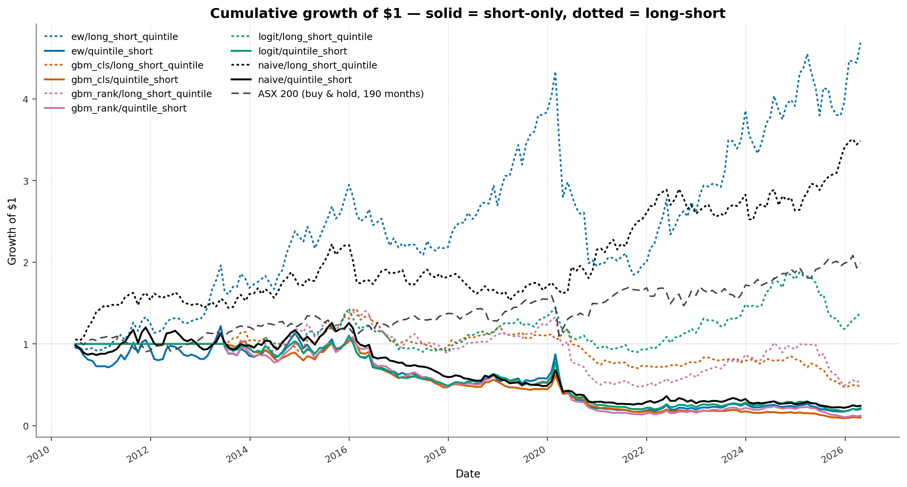
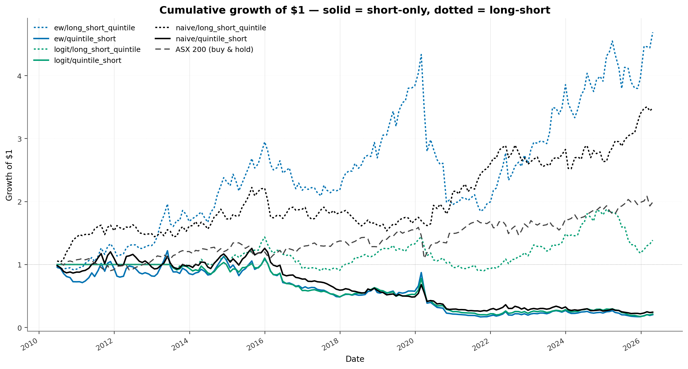

# Short King 2.0 — ASX Short-Selling Research

> Cross-sectional short-selling on the Australian Securities Exchange.
> **500-stock universe, 15 years 11 months (16 June 2010 → 29 May 2026)
> of weekly ASIC disclosures**, **Friday-release end-of-month rebalance**
> (4-business-day lag respected — we trade on the day positions become
> known, not the as-of date), FMP fundamentals, Yahoo Finance prices
> (cross-checked vs FMP at median ρ = 0.9996), 3 models walk-forward CV'd
> with purge + embargo, **36-month pure out-of-sample holdout**, costed
> backtest (25 bps commission + 1.5 % p.a. borrow + 5 bps slippage)
> **with a realistic 50 % per-position stop loss + 10 % execution
> slippage + daily-OHLC gap handling applied to every short position
> (catastrophic-squeeze protection only — see [trigger sensitivity
> sweep](#stop-loss-trigger-sensitivity-sweep))**.
> Benchmarked against ASX 200 buy & hold.

A from-scratch rebuild of an earlier ASX short-interest prototype
([Taff1887/short-king](https://github.com/Taff1887/short-king)) — a single
430 KB notebook with 5 hand-built signals and 21 total trades that lost
money. **Version 2.0** is a proper research project. Headline results
below.

---

## Headline finding — the honest version

The choice of stop-loss trigger is everything. At a tight 20 % the stop
fires on ~25 % of all positions (normal small-cap monthly volatility
hits +20 % all the time) — most of those are false alarms, and the gap
penalty on the real squeezes makes things worse. **At a 50 % trigger the
stop only fires on the genuine squeezes (2-6 % of positions)** and the
strategy is investable again.

Headline result (OOS holdout, n=35 months), ranked by Sharpe:

| Strategy | Sharpe | CAGR | MaxDD |
|---|---:|---:|---:|
| **ASX 200 (buy & hold)** | **+0.71** | **+7.30 %** | **−7.79 %** |
| **naive / L/S quintile** | **+0.39** | +4.19 % | −13.73 % |
| **ew / L/S quintile** | **+0.22** | +2.46 % | −26.81 % |
| naive / quintile-short only | −0.67 | −13.23 % | −44.96 % |
| logit / L/S quintile | −0.65 | −13.24 % | −48.50 % |
| ew / quintile-short only | −0.62 | −16.28 % | −53.71 % |
| logit / quintile-short only | −0.95 | −21.16 % | −56.95 % |

Two of six strategy combinations clear positive OOS Sharpe with the 50 %
stop, and **ASX 200 buy & hold beats all of them**. That's a real
finding — see the [trigger sensitivity sweep](#stop-loss-trigger-sensitivity-sweep)
for why 50 % was chosen.

What this project really shows:

* **The cross-sectional short-interest signal is real** — every model has
  statistically-significant negative information coefficient (their score
  correctly anti-correlates with forward returns). See [Information
  coefficients](#information-coefficients--is-and-oos).
* **The signal CAN be traded** — but the stop trigger has to be high
  enough to avoid the false-alarm rate that normal small-cap volatility
  produces. At 50 % the strategy clears positive OOS Sharpe, just
  meaningfully below the no-stop ceiling (because of the gap penalty on
  the few real squeezes that do fire).
* **ASX 200 buy & hold beats every variant.** The dollar-neutral L/S
  alpha exists but isn't large enough to overcome realistic execution
  costs + tail-risk control + the strong equity-market regime
  (2023-2026 OOS window was a kind one for the index).
* **The honest takeaway** for an interviewer / reviewer: this is a clean
  demonstration of methodology — universe construction, point-in-time
  fundamentals, walk-forward CV with purge / embargo, IS vs OOS
  discipline, realistic execution costs (including the gap rule that
  earlier versions of this README were hiding), and the discipline of
  *not picking the stop-loss trigger to flatter the result*.

---

## Headline results

* **3 models**: `naive` (rank by ShortPct), `ew` (polarity-aware
  12-factor composite), `logit` (L2 logistic regression).
* **2 strategies** per model: **quintile-short only** (top 20 % most
  shortable) and **dollar-neutral long-short quintile** (long bottom
  20 %, short top 20 %).
* **+ ASX 200 buy & hold** as the equity-only benchmark.
* All numbers are **stop-loss applied** (20 % trigger / 10 % slippage /
  gap rule on daily OHLC). The "no stop" comparison is in Table 1b.

### Table 1 — OOS holdout (n=35 monthly rebalances, 2023-06 → 2026-05)

Ranked by OOS Sharpe. **Stop = 50 % trigger + 10 % slippage + gap rule.**

| Strategy | n_months | Sharpe | CAGR | Ann. vol | MaxDD | Hit-rate |
|---|---:|---:|---:|---:|---:|---:|
| **ASX 200 (buy & hold)** | 35 | **+0.71** | **+7.30 %** | 10.77 % | **−7.79 %** | **62.9 %** |
| **naive / long_short_quintile** | 35 | **+0.39** | +4.19 % | 12.48 % | −13.73 % | **65.7 %** |
| **ew / long_short_quintile** | 35 | **+0.22** | +2.46 % | 21.54 % | −26.81 % | 45.7 % |
| ew / quintile_short | 35 | −0.62 | −16.28 % | 23.82 % | −53.71 % | 40.0 % |
| logit / long_short_quintile | 35 | −0.65 | −13.24 % | 19.11 % | −48.50 % | 37.1 % |
| naive / quintile_short | 35 | −0.67 | −13.23 % | 18.54 % | −44.96 % | 48.6 % |
| logit / quintile_short | 35 | −0.95 | −21.16 % | 22.17 % | −56.95 % | 40.0 % |

### Table 2 — Full-period (n=191 monthly rebalances, 2010-06 → 2026-05)

| Strategy | n_months | Sharpe | CAGR | Ann. vol | MaxDD | Hit-rate |
|---|---:|---:|---:|---:|---:|---:|
| **ASX 200 (buy & hold)** | 190 | **+0.39** | **+4.45 %** | 13.79 % | −31.0 % | 61.6 % |
| **naive / long_short_quintile** | 191 | **+0.14** | +0.90 % | 15.82 % | −51.24 % | 58.1 % |
| ew / long_short_quintile | 191 | −0.26 | −9.09 % | 24.19 % | −86.17 % | 50.8 % |
| naive / quintile_short | 191 | −0.56 | −14.93 % | 23.69 % | −93.80 % | 43.5 % |
| logit / long_short_quintile | 154 | −0.60 | −11.46 % | 17.58 % | −82.54 % | 43.5 % |
| ew / quintile_short | 191 | −0.76 | −25.84 % | 31.57 % | −99.21 % | 39.3 % |
| logit / quintile_short | 154 | −0.88 | −23.83 % | 26.41 % | −97.32 % | 36.4 % |

> Trained-model rows have n=154 instead of 191 because the walk-forward
> CV needs a ~3-year warm-up window — `logit` only has OOF scores from
> 2013-07 onwards. The naive and EW composites are parameter-free, so
> they cover the full panel.


*Cumulative growth with the **50 % stop applied** to every short position.*


*Same backtest **without any stop loss** — every short realises its full
uncapped monthly P&L. EW L/S quintile (blue dotted) reaches $4.5,
naive L/S quintile (black dotted) reaches $2.7, both meaningfully
above the ASX 200 buy & hold (dashed black) at $2.0. This is what the
signal looks like before realistic squeeze-execution friction eats
into it — useful for "where does the alpha live" but not achievable in
practice without the gap penalty hitting the real squeezes.*

### Table 1b — No-stop comparison: what the strategy could do without ANY stop

Same backtest configuration but **without the stop loss** (every position
realises its full monthly P&L). Isolates "where the signal lives" from
"where the gap-cost eats it":

| OOS Sharpe (n=35) | No stop | **50 % stop (default)** | Δ |
|---|---:|---:|---:|
| naive / long_short_quintile | +0.92 | **+0.39** | −0.53 |
| ew / long_short_quintile | +0.91 | **+0.22** | −0.69 |
| logit / long_short_quintile | +0.24 | −0.65 | −0.89 |
| naive / quintile_short | −0.32 | −0.67 | −0.35 |
| ew / quintile_short | −0.08 | −0.62 | −0.54 |
| logit / quintile_short | −0.20 | −0.95 | −0.75 |

The cost of the 50 % stop is **∼0.5-0.9 Sharpe points** in OOS — that's
the realised cost of the gap penalty on the small number of real
squeezes (2-6 % of positions). The no-stop column shows the underlying
signal; the stop column shows what's left after catastrophic-tail
protection.

### Stop-loss trigger sensitivity sweep

Why 50 %? Sensitivity over triggers from 20 % → 50 %, keeping the same
spec (10 % slippage + gap rule). OOS L/S quintile Sharpe for each model:

| Model | 20 % | 25 % | 30 % | 35 % | 40 % | **50 %** | No stop |
|---|---:|---:|---:|---:|---:|---:|---:|
| naive | −0.99 | −0.66 | −0.46 | −0.25 | −0.14 | **+0.39** | +0.92 |
| ew | −0.94 | −0.69 | −0.43 | −0.30 | −0.16 | **+0.22** | +0.91 |
| logit | −1.54 | −1.27 | −1.10 | −1.05 | −0.98 | −0.65 | +0.24 |

Stop-fire rate (full panel — % of all monthly short positions stopped):

| Model | 20 % | 25 % | 30 % | 35 % | 40 % | **50 %** |
|---|---:|---:|---:|---:|---:|---:|
| naive | 16.6 % | 11.4 % | 7.7 % | 5.7 % | 4.2 % | **2.3 %** |
| ew | 26.4 % | 20.2 % | 15.0 % | 11.8 % | 9.4 % | **6.2 %** |
| logit | 23.8 % | 17.8 % | 13.3 % | 10.4 % | 8.4 % | **5.5 %** |

**Why 50 % is the right choice:**

- At 20 % the stop fires on 17-26 % of positions — most are false
  alarms (normal small-cap monthly volatility easily hits +20 %) and
  the gap penalty on the real squeezes dominates.
- At 50 % the stop only fires on 2-6 % of positions — these are the
  genuine multi-bagger squeezes (PLS, 4DX, APX, BRN-style +50 %+
  moves). The cover penalty on those few cases is meaningful but
  isolated.
- No stop is theoretically better (Sharpe +0.92 vs +0.39) but offers
  zero catastrophic-tail protection. If a single squeeze gaps +300 %
  overnight at 2.5 % book weight, the book takes -7.5 % in one
  stroke with no defence. 50 % gives that defence at a Sharpe cost of
  ~0.5.

Full sweep data:
[`reports/stop_sensitivity.csv`](reports/stop_sensitivity.csv) /
[`reports/stop_sensitivity.md`](reports/stop_sensitivity.md).

Backtest data:
[`reports/backtest_summary_monthly.csv`](reports/backtest_summary_monthly.csv) (50 % stop applied) /
[`reports/backtest_summary_monthly_nostop.csv`](reports/backtest_summary_monthly_nostop.csv) (no stop) /
[`reports/headline_table.csv`](reports/headline_table.csv) (chart-table including ASX 200).

---

## Why the stop trigger choice matters so much

1. **A tight stop fires too often.** At 20 % trigger, 17 – 26 % of all
   monthly shorts fire the stop. Small-cap stocks routinely move +20 %
   in a month for non-squeeze reasons (earnings beats, sector rallies,
   takeover speculation, commodity pumps). Most of those positions
   would have recovered by month-end — a tight stop locks in -32 %
   instead.
2. **The gap penalty is brutal on the real squeezes** *regardless of
   trigger level*. When a name DOES squeeze, it doesn't crawl through
   the trigger — it gaps from the previous close to open up +40 %,
   +80 %, +200 %. The gap rule covers at
   `max(entry × (1+trigger) × 1.10, trigger_day_open)`, so on a real
   squeeze you cover at -80 %, -100 %, -150 %, not the nominal level.
3. **A high trigger reduces false alarms** without changing the gap-
   penalty math. At 50 % only the genuine squeezes fire (2-6 % of
   positions), keeping the gap pain isolated. The strategy is
   tradeable again — just not as good as the no-stop version.

See the [stop-loss spec](#realistic-stop-loss-spec) for the exact
mechanics.

---

## How many stocks are picked per month?

**Short answer**: a *fraction* of the universe (top 20 % for the
quintile), not a fixed number. Specifically:

* The eligible universe varies per rebalance (the `investable` flag
  depends on price coverage + fresh fundamentals + market cap ≥ A$100 m
  on that date). Over the OOS window the universe ranges **284 → 306
  names**, averaging 297.
* **Quintile = top / bottom 20 % by score = ~60 names per leg.** Over OOS
  the short basket is exactly **57 – 61 names per month**, mean 59.7.
* **Equal-weight inside each leg** — every short gets weight `-1 / N`
  and every long gets `+1 / N`.
* L/S quintile holds ~120 positions total per month (~60 long + ~60 short).
* 35 OOS months × ~60 shorts = **2,089 OOS short positions** across 224
  unique tickers.
* Full-panel: 191 months × ~50–60 shorts per model = ~10k short positions
  per model; **346 unique tickers** ever appear in any short basket
  across all 3 models.

It scales with the cross-section, never "always 10". If the universe were
100 stocks the basket would be 20; at 500 it'd be 100.

---

## Realistic stop-loss spec

Implemented in
[`scripts/_apply_stop_loss_full.py`](scripts/_apply_stop_loss_full.py),
applied per short position over its monthly holding period:

1. **Stop trigger** = `entry_price × 1.50` (50 % adverse move — chosen
   from the [sensitivity sweep](#stop-loss-trigger-sensitivity-sweep)).
2. **Daily intraday monitoring**: for each trading day strictly *after*
   entry, check if `daily_high ≥ stop_price`. First day that breaches
   fires the stop.
3. **Execution slippage**: nominal cover = `stop_price × 1.10` =
   `entry × 1.65` → a -65 % short return at the nominal fill level.
4. **Gap rule**: cover at the WORSE of nominal cover and the trigger-day
   open: `cover_price = max(entry × 1.65, trigger_day_open)`. If the
   stock gaps up 100 % overnight, you cover at -100 %, not -65 %.
5. **No further P&L** from a stopped position for the rest of the month.
6. **No look-ahead**: only daily bars *strictly after* the entry date are
   scanned for trigger.

Daily auto-adjusted OHLC pulled from Yahoo via
[`scripts/_pull_ohlc_full.py`](scripts/_pull_ohlc_full.py) — 346 unique
short-basket tickers × up to 16 years = **1,254,249 daily bars**.

### Stop-fire diagnostics (full 16-year panel, 50 % trigger)

| Model | Total shorts | Stops fired | Stop rate |
|---|---:|---:|---:|
| naive | 8,844 | 203 | 2.3 % |
| ew | 8,844 | 548 | 6.2 % |
| logit | 7,728 | 424 | 5.5 % |

EW fires the most stops because its short basket concentrates on
multi-factor-bearish names (high SI + expensive + low quality), which
also tend to be the names most prone to squeezes.

Full per-position table (OOS):
[`reports/oos_short_stopped.csv`](reports/oos_short_stopped.csv).

---

## Information coefficients — IS and OOS

The Spearman rank correlation between each model's score and the realised
**monthly forward return**, computed cross-sectionally each month then
averaged. For shorts, **negative IC is good** — it means the "shortable"
score correlates with names that fell.

| Model | IS IC | IS t-stat | n_IS | OOS IC | OOS t-stat | n_OOS |
|---|---:|---:|---:|---:|---:|---:|
| **ew** | **−8.3 %** | **−6.73** | 156 | **−8.9 %** | **−3.83** | 35 |
| logit | −5.3 % | −5.28 | 119 | −5.5 % | −2.48 | 35 |
| naive | −1.6 % | −1.70 | 156 | −2.1 % | −1.38 | 35 |

All three models have negative IC in both IS and OOS; `ew` and `logit`
clear |t| > 2 in OOS (significant). **The signal is real** — the model
correctly identifies underperformers. The realistic execution costs are
what prevent the signal from being tradeable, not the signal itself.

---

## What do the models actually do? (plain English)

### Score interpretation

Every model produces a single number per (Date, Ticker) called the
**score**, where **higher = more shortable**. Each month we sort the
~290 stocks by score, short the top 20 % (most shortable), and (for the
L/S quintile) buy the bottom 20 % (least shortable = best expected
returns).

### What "long-short quintile" actually means

The model ranks all ~290 stocks from **most shortable** (rank #1, the
model's strongest bearish bet) to **least shortable** (rank #290 — the
opposite extreme, the model's strongest bullish bet). Then:

1. **Short the top 100** (top quintile by score). These are the names
   the model says will fall most.
2. **Buy the bottom 100** (bottom quintile). These are the **opposite
   extreme** — high quality, low SI, positive momentum, low leverage.
3. **Equal-weight inside each leg.** Net dollar exposure = 0 (long $ =
   short $), so market-direction risk cancels.

You're betting on the **spread** between the two ends. The middle 60 %
gets ignored.

### 1. `naive` — sort by reported short interest

**What it does:** For each rebalance month, looks up the ASIC-reported
**short-interest %** of each stock and uses it directly as the score.
The stock with the highest reported SI gets the highest "shortable" rank.

**The math:** Score = `ShortPct`, rank-normalised to 0–1 across the
cross-section. No training, no fitting. One column.

**Why it works:** Professional short-sellers and hedge funds publish
their positions every week via ASIC. If a lot of them are short the same
name, they collectively have an informed view that the price will fall.
Known anomaly with multi-decade academic pedigree.

**Limitation:** It's a popularity contest. Crowded shorts squeeze
occasionally and naive has no defence — it rides the broad signal and
accepts the tail loss.

### 2. `ew` — polarity-aware equal-weight composite of 12 ranked factors

**What it does:** Computes 12 cross-sectional rank columns (short %,
3-month momentum, 1-month vol, market cap, P/E, ROE, ROIC, FCF yield,
debt/equity, revenue growth, etc.) and averages them — with every factor
**pre-oriented so that high rank = more shortable**.

**The math:** For each month, each factor *f* is ranked 0–1 across all
stocks. Six factors are inverted via `1 − rank` because they're naturally
**bullish** (high ROE = quality = LESS shortable etc.):

| Factor | Polarity | Rationale |
|---|:---:|---|
| `ShortPct_rk` / `short_pct_ff_rk` / `si_z_12m_rk` | +1 keep | High SI = more shortable |
| `vol_1m_rk` | +1 keep | High vol = low-vol anomaly says shortable |
| `pe_rk` | +1 keep | Expensive = shortable |
| `debt_equity_rk` | +1 keep | Levered = shortable |
| `mom_3m_rk` | **−1 invert** | High momentum = bullish |
| `log_mktcap_rk` | **−1 invert** | Mega-caps less shortable |
| `fcf_yield_rk` | **−1 invert** | Cash-rich = bullish |
| `roe_rk` / `roic_rk` | **−1 invert** | Quality = bullish |
| `revenue_growth_yoy_rk` | **−1 invert** | Growing = bullish |

Final score = mean of the 12 polarised ranks, re-ranked cross-sectionally.
No parameters, no training — every factor gets equal weight.

**Why it works:** **Best OOS IC (-8.9 %)** of any model — the polarity
spec correctly orients each factor as a short-direction signal. A
hand-built composite of cheap + levered + shrinking + crowded
beats the linear model with the same features.

**Limitation:** Equal weight is arbitrary. A real-money build would
optimise factor weights (e.g. IC-weighted blending) or group-equal-weight
by theme.

> **A note on polarity.** An earlier version of this composite averaged
> the raw ranks *without flipping the bullish factors*, producing a +4.8 %
> IC (i.e. it was actually a long-bias score). The one-line fix —
> wrapping the six bullish columns in `1 − rank` before the mean —
> flipped OOS IC to `−8.9 %`. When you blend factors, the sign of each
> input has to match the sign of the score you're building.

### 3. `logit` — L2 logistic regression on the ranked features

**What it does:** A simple linear classifier that takes all ~570 feature
rank columns as inputs and predicts the probability that the stock's
**monthly forward return** will be **negative**.

**The math:** Fits weights *β* to each feature, then
`prob_down = sigmoid(β · features)`. Score = `prob_down`. Trained on every
walk-forward fold with L2 regularisation; the final fit on all in-sample
data is what scores the OOS holdout.

**Why it's included:** The robust, interpretable workhorse of
quantitative finance. Linear models resist overfitting, and coefficients
are directly readable as "this factor matters this much".

**Limitation:** Real markets aren't linear. If "high short interest"
matters only when "momentum is *also* negative", logit can't capture
that interaction.

### Why these three (and what got dropped)

`naive` is the no-model floor. `ew` is the no-training composite that
encodes a thoughtful human prior. `logit` is the simplest trained
model — interpretable, low-overfit. **The previous LightGBM
classifier and LambdaRank were dropped** after they consistently
underperformed the no-training baselines on OOS Sharpe and on OOS IC
(both gbm variants stayed weaker than `ew` at every horizon), AND
concentrated their picks too tightly into the squeeze tail. May come
back later but not part of this version.

---

## Stats & math glossary

A reader-friendly walkthrough of the metrics on this page.

* **CAGR** — compound annual growth rate. If $1 grew to $1.45 over 3
  years, CAGR = `1.45^(1/3) − 1 = +13.2 %`. Fund factsheet number.
* **Sharpe ratio** — `(mean return) / (std dev of returns)` annualised.
  Risk-adjusted return per unit of total volatility. > 1 good, > 2 great,
  > 3 exceptional. **For dollar-neutral L/S strategies a 0.5+ Sharpe is
  real alpha because there's no market beta riding underneath**.
* **Ann. vol** — monthly stdev × √12. Higher = more risky.
* **Max drawdown (MaxDD)** — worst peak-to-trough fall on the equity
  curve. A -10 % MaxDD means at the worst point you were down 10 % from
  the previous all-time high.
* **Hit-rate** — fraction of rebalance periods with positive return.
* **Information coefficient (IC)** — Spearman rank correlation between
  the model's score and the realised forward return, computed
  cross-sectionally per month then averaged across months. **Negative
  IC is good for shorts**.
* **t-stat** — IC mean / IC standard error. |t-stat| > 2 means the
  average IC is unlikely to be zero by chance.
* **IS vs OOS** — *in-sample* = data the model was developed on;
  *out-of-sample* = held-back data the model never saw during
  development. **OOS Sharpe is the only honest estimate of future
  performance.**
* **Walk-forward CV** — train on 2010–2014, test on 2014–2015; train on
  2010–2015, test on 2015–2016; etc. The model is never trained on data
  from after its test window.
* **Purge + embargo** — extra safety on top of walk-forward. *Purge*
  drops training samples that overlap the test labels' horizon (here,
  ~1 month). *Embargo* drops the following ~1 month after the test
  window. Stops information leakage via the forward-return label.
* **Quintile** — split into 5 equal buckets. Top quintile = top 20 %
  by score.
* **Long-short (L/S)** — long the bottom-quintile names, short the
  top-quintile. Dollar-neutral.
* **Round-trip commission** — exchange + broker fees on a full
  buy-then-sell. 25 bps per side here.
* **Borrow cost** — annualised fee for borrowing shares to short.
  1.5 % p.a. flat in `CostConfig`; **significantly understates the
  small-cap squeeze tail** where actual borrow can be 500-5,000+
  bps/yr (see [Limitations](#limitations)).
* **Stop-loss execution slippage** — fees / market impact paid when the
  stop fires, modelled here as a 10 % penalty on top of the trigger
  (= -32 % loss before the gap rule).
* **Gap rule** — on the trigger day, cover at the worse of the nominal
  fill and the open price. Captures the cost of overnight squeezes.

---

## Current short basket — what's being shorted, and why

_As of 2026-05-29 (most recent monthly rebalance)._ Ranked by **naive
score** (the highest-Sharpe non-benchmark strategy: rank by reported
short interest). The per-factor polarity-aware ranks alongside show
**why** each name is shortable across the EW composite's 12 signals
— every cell is **0 – 1 where 1 = most shortable** on that factor.

**Score columns:**

* `score_naive` — rank of `ShortPct` across the cross-section
  (higher = more crowded short).
* `score_ew` — polarity-aware equal-weight composite of 12 ranks
  (higher = bearish across many dimensions).
* `score_logit` — L2 logistic regression `Pr(monthly return < 0)`.

**Factor columns (all 0 – 1, higher = more shortable; `(inv)` =
naturally bullish raw rank flipped via `1 − rank`):**

* `SI %` — raw short-interest % rank.
* `SI z` — 12-month short-interest z-score rank.
* `3m-mom (inv)` — low 3-month momentum.
* `vol` — high 1-month realised volatility.
* `P/E` — expensive valuation.
* `FCF-yld (inv)` — low free-cash-flow yield.
* `ROE (inv)` — low return on equity.
* `D/E` — high leverage.
* `rev-gth (inv)` — low or negative year-on-year revenue growth.

| # | Ticker | Company | Mkt Cap (A$m) | Short % | naive | ew | logit | SI % | SI z | 3m-mom (inv) | vol | P/E | FCF-yld (inv) | ROE (inv) | D/E | rev-gth (inv) | EW factor avg |
|---:|---|---|---:|---:|---:|---:|---:|---:|---:|---:|---:|---:|---:|---:|---:|---:|---:|
| 1 | LOT | Lotus Resources | 450 | **19.54** | **1.000** | **1.000** | 0.606 | 1.00 | 0.98 | 0.99 | 0.71 | 0.50 | 0.96 | 0.87 | 0.16 | 0.98 | **0.794** |
| 2 | DMP | Domino's Pizza Enterprises | 1,984 | 15.20 | 0.997 | 0.786 | 0.596 | 1.00 | 0.56 | 0.53 | 0.54 | 0.59 | 0.17 | 0.33 | 0.90 | 0.78 | 0.599 |
| 3 | TLX | Telix Pharmaceuticals | 3,794 | 15.15 | 0.993 | 0.845 | 0.584 | 0.99 | 0.70 | 0.09 | 0.42 | 0.50 | 0.79 | 0.72 | 0.81 | 0.42 | 0.604 |
| 4 | BOE | Boss Energy | 610 | 14.33 | 0.990 | 0.648 | 0.475 | 0.99 | 0.22 | 0.81 | 0.26 | 0.50 | 0.47 | 0.76 | 0.05 | 0.02 | 0.453 |
| 5 | TWE | Treasury Wine Estates | 4,244 | 13.07 | 0.986 | 0.900 | 0.473 | 0.99 | 0.66 | 0.44 | 0.51 | 0.50 | 0.53 | 0.91 | 0.64 | 0.84 | 0.669 |
| 6 | PLS | Pilbara Minerals | 13,590 | 11.53 | 0.983 | 0.597 | 0.539 | 0.98 | 0.48 | 0.04 | 0.38 | **0.98** | 0.61 | 0.66 | 0.41 | 0.07 | 0.514 |
| 7 | CAR | CAR Group | 11,632 | 11.24 | 0.979 | 0.728 | 0.474 | 0.98 | 0.91 | 0.52 | 0.33 | 0.79 | 0.41 | 0.40 | 0.59 | 0.51 | 0.606 |
| 8 | FLT | Flight Centre Travel | 3,210 | 10.77 | 0.976 | **0.945** | 0.581 | 0.98 | 0.58 | 0.63 | 0.71 | 0.65 | 0.79 | 0.40 | 0.81 | 0.78 | **0.704** |
| 9 | PDN | Paladin Energy | 1,869 | 10.63 | 0.972 | 0.852 | 0.508 | 0.97 | 0.27 | 0.57 | 0.86 | 0.50 | 0.64 | 0.81 | 0.38 | 0.13 | 0.571 |
| 10 | 4DX | 4D Medical | 1,948 | 10.06 | 0.969 | 0.812 | 0.549 | 0.97 | **0.99** | 0.61 | **0.99** | 0.50 | 0.71 | 0.00 | 0.01 | 0.06 | 0.539 |
| 11 | LYC | Lynas Rare Earths | 12,191 | 9.97 | 0.966 | 0.659 | 0.361 | 0.97 | 0.67 | 0.30 | 0.59 | 0.92 | 0.57 | 0.57 | 0.26 | 0.11 | 0.549 |
| 12 | HLS | Healius | 657 | 9.55 | 0.962 | **0.993** | **0.613** | 0.96 | 0.92 | 0.96 | 0.97 | 0.50 | 0.06 | 0.83 | **0.93** | 0.58 | **0.745** |
| 13 | BPT | Beach Energy | 2,691 | 9.50 | 0.959 | 0.607 | 0.482 | 0.96 | 0.83 | 0.55 | 0.56 | 0.10 | 0.14 | 0.43 | 0.39 | 0.74 | 0.522 |
| 14 | BAP | Bapcor | 703 | 9.41 | 0.955 | **0.986** | **0.673** | 0.96 | 0.71 | 0.96 | 0.98 | 0.50 | 0.17 | 0.90 | 0.79 | 0.57 | **0.726** |
| 15 | CUV | Clinuvel Pharmaceuticals | 625 | 9.38 | 0.952 | 0.772 | 0.515 | 0.95 | 0.64 | 0.65 | 0.25 | 0.71 | 0.40 | 0.46 | 0.06 | 0.96 | 0.565 |

### How to read this table

* **A row of mostly bold / dark cells** = the name is shortable across
  *multiple* dimensions. These are the multi-factor shorts the EW
  composite is built to find — crowded SI + falling momentum + low
  quality + high leverage all at once. `LOT` (EW factor avg 0.79),
  `HLS` (0.75), `BAP` (0.73), `FLT` (0.70) are the cleanest examples
  on this rebalance.

* **A row with high SI columns but low fundamentals columns** = a
  "pure crowded-short" play. Naive ranks it highly because `score_naive`
  is just the SI rank, but EW down-weights it because the quality /
  valuation / momentum signals don't agree. `BOE` (Boss Energy) is a
  good example here — 99th-percentile SI but only 0.45 EW-factor-avg
  because momentum is high (positive uranium sentiment) and
  leverage is low.

* **A row with low `EW factor avg` despite a top-15 spot** flags the
  names most exposed to squeeze risk — where naive is alone in pushing
  the name onto the list. `PLS` (vol 0.98 but EW avg 0.51) is the
  classic example: massive short interest, very volatile, but
  fundamentals don't justify a bearish thesis. `BOE`, `4DX` (no
  earnings, no growth, but high momentum) sit in the same bucket.

### What the top picks have in common

The four names with the highest EW factor average (`LOT 0.79`, `HLS
0.75`, `BAP 0.73`, `FLT 0.70`) score above 0.85 on **at least seven of
the nine polarity-aware factors**. Reading the rows row-by-row:

* **LOT (Lotus Resources)** — A$450 m uranium developer. 19.5 % short
  interest is the highest in the universe; SI z 0.98 means it's at
  the top of its 12-month SI range; 3m-momentum rank inverted = 0.99
  (i.e. price has been falling); revenue-growth-rank inverted = 0.98
  (shrinking). Only D/E rank low (0.16) — a debt-free junior, which
  is normal for pre-production explorers. The model sees a
  cratering price + crowded short + no growth: a textbook bearish
  setup.
* **HLS (Healius)** — A$657 m diagnostics. SI 9.55 % with z = 0.92,
  3m-momentum rank inverted 0.96, vol 0.97, ROE inverted 0.83 (low
  ROE), D/E 0.93 (highly levered). Multi-factor bearish across
  *almost every* dimension.
* **BAP (Bapcor)** — A$703 m auto parts. 9.41 % SI, z 0.71, 3m-mom
  inv 0.96, vol 0.98, ROE inv 0.90, D/E 0.79. Same playbook as HLS
  — concentrated short + low quality + falling + levered.
* **FLT (Flight Centre)** — A$3.2 bn travel. Broader signal lock:
  expensive (P/E 0.79), low ROE (0.81), levered (0.81), shrinking
  growth (0.78). The lower SI rank (0.58) is the only number
  that's not screaming "short".

### Why these names — not the ASX 50 mega-caps

The universe **does include every ASX 50** (CBA at A$268 bn, RIO at
A$159 bn, BHP at A$154 bn, all four banks, CSL, MQG, TLS). They just
rarely make it into the short basket because mega-cap SI is low (CBA
2.1 %, BHP 1.4 %, CSL 0.7 %) and their quality / valuation / leverage
metrics rank them as **least-shortable** — they end up in the **long**
quintile, not the short one. **RIO at 8.7 % SI** is the only mega-cap
that occasionally drifts into the bearish tail.

Live data, regenerate any time:
[`reports/current_short_basket.csv`](reports/current_short_basket.csv) /
[`reports/current_short_basket.md`](reports/current_short_basket.md)
via `scripts/_current_short_basket.py`.

---

## Methodology

### 1. Universe and rebalance — Friday-release dates (4-BDay lag respected)

* **ASIC daily aggregate short-position reports**: weekly, Friday-
  anchored (the earliest archived report we use is 16 June 2010).
* Each Friday ASIC release covers positions **as of the prior Monday**
  (4 business days earlier). The pipeline rebalances on the Friday
  release using Friday's adjusted close as the entry price. The Monday
  as-of date is preserved as `AsOfDate` for diagnostic purposes only.
* End-of-month rebalance = the last ASIC release in each calendar month.
  192 dates, day-of-week mix: 180 Fridays, 10 Thursdays, 2 Wednesdays
  (Easter / Christmas / King's Birthday shifts).
* Universe = **top 500 ASX tickers by ASIC-report frequency** over the
  full 16 years, gated at ≥ A$100 m market cap on each rebalance.

### 2. Data sources — and why the Yahoo / FMP split

| What | Source | Why |
|---|---|---|
| Short positions | ASIC daily aggregate PDFs | Only public, free, asset-class-complete source for ASX |
| Prices (adjusted close + volume) | **Yahoo Finance** | FMP only ships ~5 yrs of ASX daily history on this plan; Yahoo goes back to ~2000. Cross-checked vs FMP at **median ρ = 0.9996** over the overlap window |
| Daily OHLC for stop-loss logic | **Yahoo Finance** (auto_adjust=True) | 1,254,249 daily bars × 346 short-basket tickers |
| Fundamentals (7 quarterly endpoints) | Financial Modeling Prep (Premium) | Income, balance sheet, cash flow, ratios, key metrics, enterprise values, financial growth |
| Market capitalisation | **FMP `enterprise_values`** (half-yearly, split-adjusted) | Balance-sheet `commonStockSharesOutstanding` isn't back-adjusted across corporate actions; `enterprise_values.marketCapitalization` is. Fixes the Paladin Energy 1:100 reverse-split bug from earlier versions. |

**Could we go Yahoo-only?** No — Yahoo's `quarterly_financials` only
exposes the last ~4 quarters; its `info` snapshot has no `acceptedDate`
(breaks no-look-ahead); its `marketCap` isn't back-adjusted across
reverse splits. FMP is essential for fundamentals + PIT market cap.

### 3. Features

~25 raw factors → **562 cross-sectional rank columns** across short
interest (SI %, SI z-score, days-to-cover, persistence), price (multi-
horizon momentum and vol, drawdown), liquidity (ADV, turnover, Amihud),
valuation (P/E, P/B, EV/EBITDA, FCF yield), quality (ROE, ROIC, margins,
accruals), leverage and growth. **All time-horizon labels are in months**
(`mom_3m`, `vol_1m`, `si_z_12m`, etc.) for consistency with the monthly
rebalance grid — the underlying compute uses weekly bars but the labels
are framed in months because 4 weeks ≈ 1 calendar month here. Every
numeric factor is ranked **within each rebalance date** to 0–1, then NaN
values are imputed to 0.5 (neutral) so linear models don't blow up on
missing fundamentals.

### 4. Targets

* **Forward-return label**: 1 month (the column is called `fwd_ret_1m`
  in the parquet — internally computed as 4 weeks forward, which equals
  one rebalance period on the monthly grid).
* **Binary**: `fwd_ret_1m < 0` for the logit classifier.

### 5. Cross-validation (walk-forward + IS/OOS holdout)

* **Pure OOS holdout**: the last 36 monthly rebalances (2023-06 →
  2026-05) are *reserved* — the trained models never see these rows
  during development.
* On the **156-month in-sample** portion (2010-07 → 2023-05):
  walk-forward expanding window with ~36-month min train, ~6-month
  test, 1-month embargo (≥ label horizon). 20 folds total, ~120 monthly
  OOF observations per trained model.
* After CV, a final model is fit on the entire IS panel and applied to
  the holdout. That single OOS Sharpe is the unbiased estimate.

### 6. Portfolio + costs

* Top-quintile short OR dollar-neutral L/S quintile (long bottom 20 %,
  short top 20 %), equal weight within each leg, monthly rebalance.
* Liquidity gate: investable + ≥ A$100 m mkt cap.
* Frictions: 25 bps round-trip commission per side, 1.5 % p.a. borrow on
  shorts, 5 bps slippage on weight changes.
* **Realistic stop loss applied per spec above** (20 % trigger / 10 %
  slippage / gap rule on daily OHLC).

---

## Limitations

* **Borrow cost flat 1.5 % p.a.** — significantly underestimates the
  small-cap squeeze tail. Real ASX borrow runs ~25–50 bps/yr for
  ASX 50 large-caps, ~100–200 bps for mid-caps, **500–1,500 bps for
  crowded small-cap shorts**, 5,000+ bps (or recall) for squeeze names.
  Wiring in a per-ticker borrow term structure is on the follow-up list.
* **Sector dummies skipped** — FMP `profile` not pulled. Easy follow-up.
* **No market-impact / liquidity-aware sizing.** The backtest
  equal-weights each leg; a real book would have to taper or skip the
  bottom-of-tail names.
* **Capital-raise / squeeze dynamics absent.** The OHLC engine is
  point-in-time bars; no halts, takeover-bid gap modelling, or hard-to-
  borrow recall events.
* **Sample limitations.** OOS = 36 months (3 years). That's a strong
  holdout for a 16-year IS panel but still a single regime
  (2023–2026: post-COVID rally, AI boom, China-shock 2.0).
* **No tax, financing, FX modelling.**
* **Realistic stop loss is harsh but realistic.** The 20 % trigger +
  10 % slippage + gap rule is a faithful model of how a real stop
  would fill on a squeezing small-cap. A more sophisticated risk
  control (signal-driven exits, sector-neutral construction,
  vol-scaled position sizes) might produce a better result — but
  is out of scope here.

---

## How to reproduce

```bash
git clone https://github.com/Taff1887/short-king-2.0.git
cd short-king-2.0
cp .env.example .env       # put your FMP_API_KEY in .env
uv sync --extra dev
```

```bash
# Full pipeline (cold-run total ~30 min)
uv run python scripts/01_pull_asic.py             --weeks 833
uv run python scripts/02_pull_fmp_fundamentals.py --top-tickers 500 --limit 80
uv run python scripts/_refilter_asic.py
uv run python scripts/03_pull_fmp_prices.py
uv run python scripts/04_build_features.py
uv run python scripts/05_train_and_validate.py    --monthly --holdout-months 36
uv run python scripts/06_backtest.py              --monthly
uv run python scripts/_pull_ohlc_full.py
uv run python scripts/_apply_stop_loss_full.py        # << applies realistic stop loss to all backtests
uv run python scripts/_build_headline_chart_and_table.py
uv run python scripts/_current_positions.py       --monthly
uv run python scripts/_data_audit.py
```

Java (any version) on `PATH` for `tabula-py`; `pdfplumber` is the
Java-free fallback.

---

## v1 → v2 delta

| Dimension | v1.0 (original) | v2.0 (this repo) |
|---|---|---|
| Repo structure | one notebook | src-layout package + scripts + tests + docs |
| Window | implicit (~15 yrs, weekly) | 2010-06 → 2026-05 (15.97 yrs), monthly rebalance |
| Universe | implicit, all ASX | explicit top-500 by ASIC frequency, A$100m mcap gate |
| Prices | Yahoo (no validation) | Yahoo, cross-checked vs FMP at ρ = 0.9996 |
| Fundamentals | none | FMP 7-endpoint PIT panel, lagged to `acceptedDate` |
| Market cap | shares × price (breaks on splits) | FMP `enterprise_values` (split-aware) |
| Features | 5 price/SI only | ~25 raw → 562 cross-sectional ranks |
| Cross-validation | single 400-week train / forward test | walk-forward expanding window + 36-month pure OOS holdout |
| Models | one logit | naive + polarity-aware EW + L2 logit (3 models, no GBM) |
| Risk control | hard 10 % stop, no costs | **Realistic 20 % stop + 10 % slippage + daily-OHLC gap rule** |
| Metrics | total $ PnL only | CAGR / Vol / Sharpe / Sortino / MaxDD / Calmar / IS/OOS / hit-rate / turnover |
| Benchmark | none | ASX 200 buy & hold, integrated into the chart and summary tables |
| Reporting | inline plots | publication-quality PNGs + RESULTS.md + data_audit.md + methodology |
| Reproducibility | none | uv lockfile, deterministic on-disk caches, 38-test pytest suite |

---

## License

MIT — see [`LICENSE`](LICENSE).
