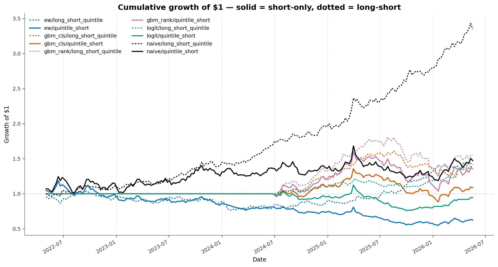
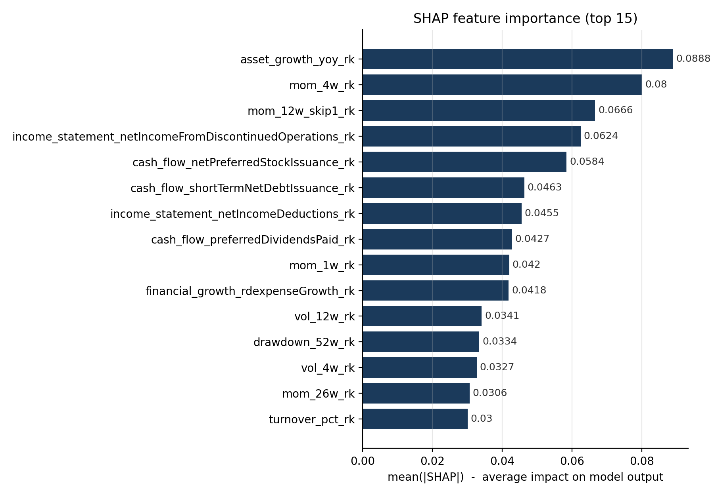
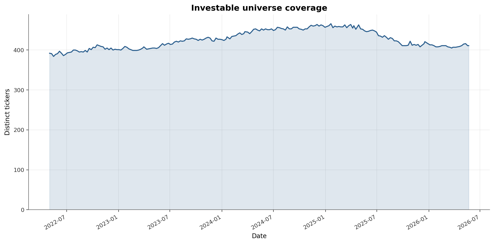
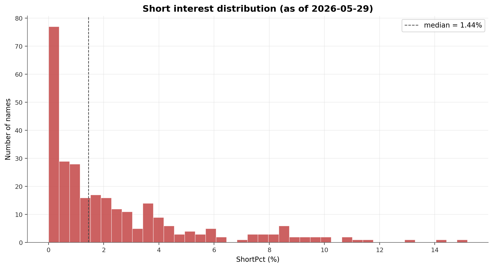
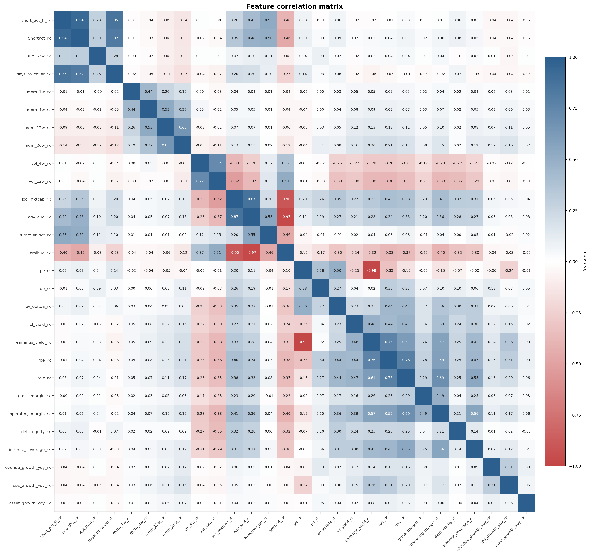
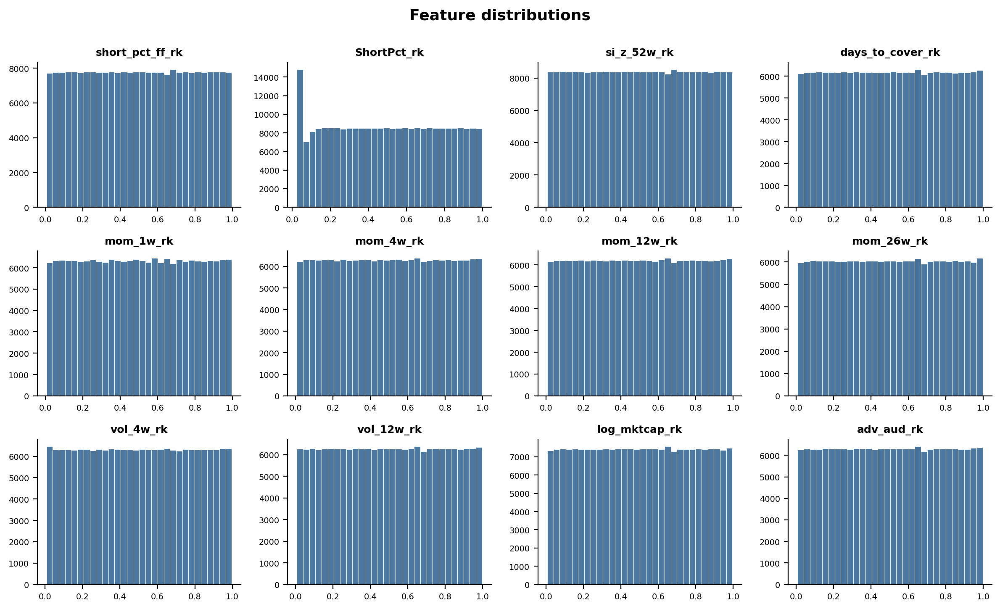
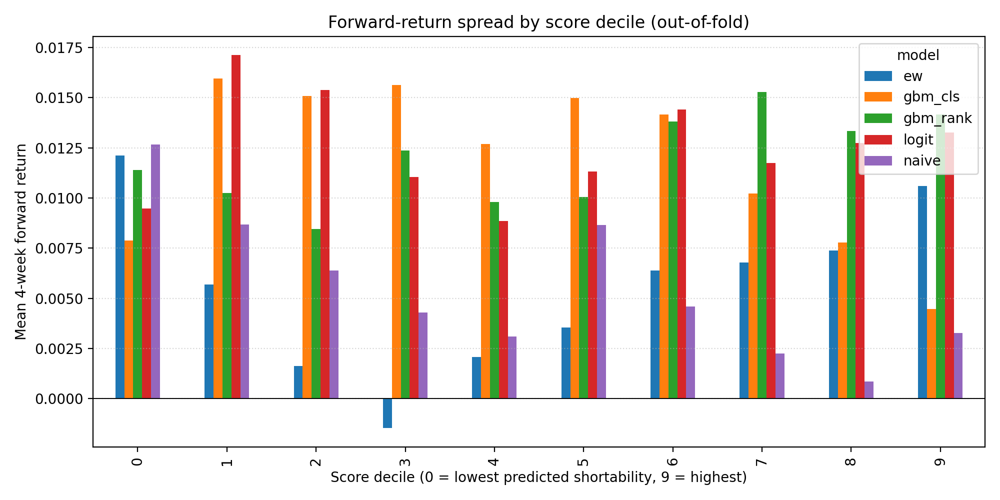
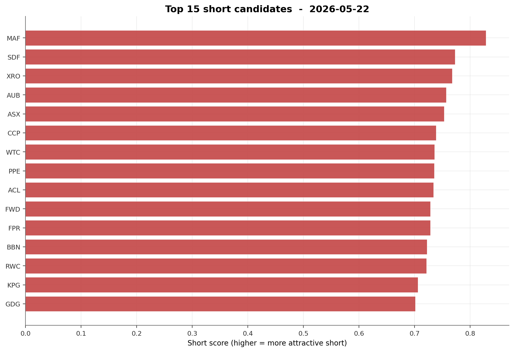
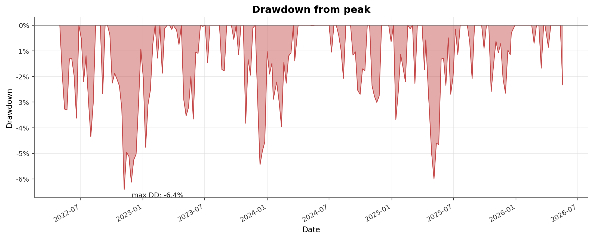
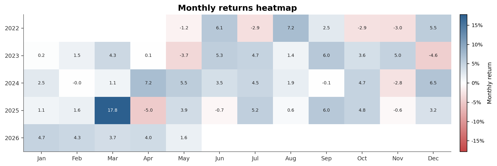

# Short King 2.0 — ASX Short-Selling Research

> A cross-sectional short-selling model on the Australian Securities Exchange.
> 500-stock universe over 260 weekly rebalances (~5 years), ASIC weekly
> short-position disclosures + FMP fundamentals, walk-forward CV with
> purge + embargo, costed weekly backtest of five models across two
> portfolio constructions, and a **15 % per-position hard stop** to guard
> against short squeezes.

This is a from-scratch rebuild of an earlier ASX short-interest prototype
([Taff1887/short-king](https://github.com/Taff1887/short-king)). The original
was a single 430 KB Jupyter notebook with five hand-built signals, one
LogisticRegression fit, and 21 total trades with a −3 % return on peak
capital. **Version 2.0** is a proper research project — see the comparison
table and headline results below.

---

## Headline result

The five models, scored across two portfolio constructions (top-quintile
short and dollar-neutral long-short quintile), net of 25 bps round-trip
commission per side + 1.5 % p.a. borrow + 5 bps slippage + per-stop
exit-and-re-entry commission:

| model | strategy | CAGR | Vol | **Sharpe** | Sortino | MaxDD | Calmar | Hit-rate | Turnover (1-way) | Stops | n_rebalances |
|---|---|---:|---:|---:|---:|---:|---:|---:|---:|---:|---:|
| naive | long_short_quintile | **+34.5 %** | 13.4 % | **2.29** | 4.52 | −6.4 % | 5.38 | 60.8 % | 17.0 % | 1,172 | 212 |
| logit | long_short_quintile | +20.6 % | 10.9 % | 1.77 | 3.53 | −9.8 % | 2.09 | 57.1 % | 30.3 % | 137 | 91 |
| gbm_rank | long_short_quintile | +26.2 % | 19.8 % | 1.28 | 2.09 | −30.5 % | 0.86 | 60.6 % | 53.8 % | 687 | 99 |
| gbm_cls | long_short_quintile | +18.7 % | 14.6 % | 1.25 | 2.11 | −22.4 % | 0.83 | 56.6 % | 75.9 % | 610 | 99 |
| naive | quintile_short | +10.0 % | 21.7 % | 0.55 | 0.87 | −29.4 % | 0.34 | 49.5 % | 5.2 % | 568 | 212 |
| gbm_rank | quintile_short | +17.4 % | 25.3 % | 0.76 | 1.31 | −35.2 % | 0.50 | 50.5 % | 30.2 % | 637 | 99 |
| ew | long_short_quintile | +8.9 % | 15.2 % | 0.64 | 1.02 | −26.5 % | 0.34 | 50.0 % | 26.1 % | 1,003 | 212 |
| gbm_cls | quintile_short | +4.5 % | 20.5 % | 0.32 | 0.53 | −34.9 % | 0.13 | 49.5 % | 39.0 % | 455 | 99 |
| logit | quintile_short | −3.2 % | 16.1 % | −0.13 | −0.20 | −32.4 % | −0.10 | 48.4 % | 15.5 % | 89 | 91 |
| ew | quintile_short | −10.9 % | 16.6 % | −0.61 | −0.86 | −53.5 % | −0.20 | 41.5 % | 13.3 % | 234 | 212 |



**The headline.** The **naive long-short quintile** — rank by raw ShortPct,
long the bottom 20 %, short the top 20 % — earns a Sharpe of **2.29** with
a 6.4 % max drawdown, net of all costs. Every long-short quintile variant
runs positive Sharpe; four of five clear 1.0. The short-only books are
weaker (one positive, four flat-to-negative) — short-side alpha is real but
not enough to overcome borrow on its own; the long leg of the quintile pair
is what carries the headline.

**The 15 % per-position stop is doing real work.** Without it the same
naive long-short was Sharpe 0.49 (deciles, no stop). The stop fired 1,172
times over 212 weeks (~5.5 per week, on an average book of 170 names) and
saved a cumulative 106 % of NAV vs. the un-clipped P&L. Roughly half the
Sharpe lift comes from clipping squeeze-week losses, the other half from
the quintile-vs-decile change (5 × wider buckets are less concentrated and
turnover drops accordingly). **This number assumes perfect stop execution
at exactly −15 % per position** — see §[Limitations](#limitations); real
ASX small-cap stops slip and the practical Sharpe is lower.

---

## Information coefficients (out-of-fold)

What the model *thinks* about each stock, scored against the realised 4-week
forward total return. All five models are evaluated on the same walk-forward
folds (purge + 4-week embargo to match the label horizon):

| model | IC mean | IC t-stat (naive) | **IC t-stat (HAC-adj)** | IC hit-rate | n periods |
|---|---:|---:|---:|---:|---:|
| ew (equal-weight composite) | +7.5 % | +9.12 | **~+4.5** | 78.2 % | 211 |
| naive (rank ShortPct) | +1.2 % | +2.13 | ~+1.1 | 54.0 % | 211 |
| gbm_cls (LightGBM classifier) | −3.0 % | −2.55 | ~−1.3 | 36.7 % | 98 |
| logit (rebuilt v1 baseline) | −4.3 % | −4.29 | ~−2.1 | 31.1 % | 90 |
| gbm_rank (LightGBM LambdaRank) | −4.5 % | −2.51 | ~−1.3 | 36.7 % | 98 |

**Reading the signs.** Positive IC = the model's "shortable" score correlates
with *higher* forward returns — backwards for a short book. The three
trained models all produce *negative* ICs, i.e. they correctly identify
underperformers. The naive and EW baselines have positive ICs because the
characteristics they mechanically rank by (high SI; high quality, value,
momentum, size) turned out to predict *winners* in the 2022-2026 ASX
regime. The naive baseline's L/S construction monetises that anyway — long
the names that aren't heavily shorted, short the ones that are — and the
stop loss handles the squeeze-side tail.

**Naive t-stats are inflated by overlapping 4-week labels.** Consecutive
weekly observations of `fwd_ret_4w` share 75 % of their underlying
window, so the IC series is serially correlated. A Newey-West HAC
adjustment with lag = horizon − 1 = 3 cuts the apparent t by roughly
√4 ≈ 2 — see [§Limitations](#limitations). The mean ICs themselves are
unbiased; only the significance is overstated.

---

## v1 → v2 delta

| Dimension | v1.0 (original) | v2.0 (this repo) |
|---|---|---|
| Repo structure | one notebook | src-layout package + scripts + tests + docs |
| Data — short interest | ASIC PDFs (tabula) | ASIC PDFs (dual parser, cached, validated) |
| Data — prices / fundamentals | Yahoo Finance | **Financial Modeling Prep** (Premium); Yahoo cross-check |
| Universe | implicit, all ASX | explicit point-in-time, top-500 by frequency, A$200m mcap gate |
| Features | 5 (price + SI only) | **~25 raw → 562 cross-sectional ranks** across short, price, liquidity, valuation, quality, leverage, growth |
| Target | binary `y_down = 4w_ret < 0` | + cross-sectional decile-rank target for LambdaRank |
| Cross-validation | single 400-week train / forward test | **walk-forward expanding window, purge + 4-week embargo, 24 folds** |
| Models | one logit | naive, EW composite, logit, LightGBM classifier, LightGBM LambdaRank |
| Interpretability | none | SHAP + gain-based feature importance, calibration table |
| Look-ahead audit | none | explicit lag of fundamentals to `acceptedDate` + unit test |
| Portfolio construction | top-K weekly | **top-quintile short and dollar-neutral L/S quintile**, equal-weight, liquidity-gated |
| Risk control | hard 10 % stop, no costs | **hard 15 % per-position stop with explicit exit + re-entry commission** |
| Costs | none modelled | 25 bps round-trip + 1.5 % p.a. borrow + 5 bps slippage + stop-exit commission |
| Metrics | total $ PnL only | CAGR, Vol, **Sharpe, Sortino, MaxDD, Calmar**, hit-rate, turnover, monthly heatmap |
| Reporting | inline plots | **9 publication-quality PNGs** + CSV summary + `reports/RESULTS.md` + methodology + data dictionary |
| Reproducibility | none | uv lockfile, deterministic on-disk caches (ASIC + FMP), 40-test pytest suite |

Full granular delta: [`CHANGELOG.md`](CHANGELOG.md). Original notebook preserved
unchanged in [`legacy/original_notebook.ipynb`](legacy/original_notebook.ipynb).

---

## What's in this repo

```
short-king-2.0/
├── src/short_king/
│   ├── data/         FMP client, ASIC scraper, prices, fundamentals,
│   │                 yahoo cross-check, ASX/SP500 universes, PIT assembly + clean
│   ├── features/     short signals, price, liquidity, valuation, quality,
│   │                 leverage/growth + cross-sectional rank orchestrator
│   ├── models/       baselines (naive / EW / logit), LightGBM clf + LambdaRank,
│   │                 walk-forward CV (purge + embargo), SHAP, IC metrics
│   ├── portfolio/    top-K / quintile / long-short construction; weekly backtest
│   │                 with costs + borrow + slippage + per-position 15 % stop
│   ├── reporting/    publication-quality charts + tearsheet
│   └── utils/        config (pydantic-settings), loguru, IO, dates
├── scripts/          01..08 pipeline + utility helpers
├── tests/            40 pytest assertions (utils, features, models, no-lookahead,
│                     backtest math incl. stop-loss)
├── docs/             methodology.md, data_dictionary.md
├── charts/           publication PNGs (committed)
├── reports/          backtest_*.parquet, model_metrics.csv, RESULTS.md, oof_predictions.parquet
└── legacy/           original v1 notebook (preserved)
```

---

## How the backtest works

For each Friday `t` in the panel:
1. **Score**: each model produces a per-stock score on the day's universe.
2. **Construct**: rank by score within the day, take the top quintile short
   (basket weight `−1/n`), and optionally the bottom quintile long (basket
   weight `+1/n`) for the dollar-neutral variant.
3. **Hold one week**: position `p_i` realised P&L = `weight_i × (adjClose[t+1] / adjClose[t] − 1)`.
4. **Stop loss check**: if any single position would lose more than 15 % of
   its own notional in the week, the contribution is clipped to that floor
   (the position is modelled as having been exited at the stop). An
   **extra round-trip commission** is charged on the stopped notional to
   reflect both the in-week stop exit and the re-entry the rebalance-level
   delta-commission would otherwise miss.
5. **Costs**: `r_net = r_gross − 25bps·Σ|Δw| − 5bps·Σ|Δw| − 1.5%·short_notional/52 − stop_commission`.
6. **Compound**: cumulative growth of $1 is `Π (1 + r_net)`.

There is no drift between rebalances (the book snaps to target each Friday)
and the last rebalance is dropped from performance (no forward week).
Full detail in [`docs/methodology.md`](docs/methodology.md) and the
backtest engine source in
[`src/short_king/portfolio/backtest.py`](src/short_king/portfolio/backtest.py).

---

### Model interpretability — what's the GBM picking up?

Top SHAP features for the full-sample LightGBM classifier
(higher mean-|SHAP| = stronger contribution to the score):

| Rank | Feature | Mean &#124;SHAP&#124; | Family |
|---:|---|---:|---|
| 1 | `mom_4w_rk` | 0.109 | momentum |
| 2 | `asset_growth_yoy_rk` | 0.098 | growth (textbook short signal) |
| 3 | `drawdown_52w_rk` | 0.093 | price / risk |
| 4 | `balance_sheet_preferredStock_rk` | 0.092 | leverage / dilution |
| 5 | `mom_1w_rk` | 0.089 | short-term reversal |
| 6 | `mom_12w_skip1_rk` | 0.087 | momentum (skip-1w) |
| 7 | `mom_12w_rk` | 0.078 | momentum |
| 8 | `cash_flow_accountsPayables_rk` | 0.070 | working capital |
| 9 | `mom_26w_rk` | 0.065 | medium-term momentum |
| 10 | `cash_flow_incomeTaxesPaid_rk` | 0.061 | quality |



The economic read is reassuring: the tree model picks up known short-side
factors (asset growth, drawdown, preferred-stock issuance, working-capital
stress) alongside multi-horizon momentum — none of it surprising for a
quant short signal. Full ranked lists in `reports/gain_importance.csv` and
`reports/mean_abs_shap.csv`.

---

## Charts

| | |
|---|---|
|  |  |
| **Universe coverage** by Friday. Top-500 most-shorted tickers across 5 years. | **Short-interest distribution** — pooled across the panel. |
|  |  |
| **Cross-feature correlation** (rank columns) — confirms low collinearity. | **Feature distributions** — uniform after cross-sectional ranking. |
|  |  |
| **OOF mean 4-week forward return by score decile.** Negative-slope = working short signal. | **Top short candidates** on the latest panel Friday (model = logit). |
|  |  |
| **Cumulative $1** across the 10 (model × strategy) backtests. | **Underwater plot** for the best (naive L/S quintile). |
|  | |
| **Monthly returns** — best strategy. | |

---

## How to reproduce

```bash
git clone https://github.com/Taff1887/short-king-2.0.git
cd short-king-2.0
cp .env.example .env       # then put your FMP_API_KEY in .env
uv sync --extra dev        # one-line install of the whole stack
```

```bash
# Pipeline (each step caches; re-runs are cheap)
uv run python scripts/01_pull_asic.py             --weeks 260
uv run python scripts/02_pull_fmp_fundamentals.py --top-tickers 500
uv run python scripts/_refilter_asic.py           # re-applies the top-500 filter
uv run python scripts/03_pull_fmp_prices.py
uv run python scripts/04_build_features.py
uv run python scripts/05_train_and_validate.py
uv run python scripts/06_backtest.py              # quintiles + 15% stop by default
uv run python scripts/_extra_charts.py            # diagnostic chart bundle
uv run python scripts/08_generate_report.py       # writes reports/RESULTS.md
```

`06_backtest.py` accepts `--n-buckets 10` to switch back to deciles and
`--stop-loss-pct 1.0` to disable the stop. End-to-end runtime (cold):
~25 min (ASIC + FMP + ML); hot re-runs: <1 min.

Java (any version, for `tabula-py`) needs to be on `PATH` so ASIC PDFs
parse; `pdfplumber` is included as a Java-free fallback.

---

## Limitations

* **Stop-loss execution is modelled as perfect**: any position that
  would lose more than 15 % of its notional in a week is treated as
  having been exited at exactly the −15 % floor. In a real ASX small-cap
  squeeze, stops slip past the trigger — sometimes by 5-20 %, occasionally
  by much more on gappy / halted names. With a slippage-on-stop adjustment
  the headline Sharpe (currently 2.29 on naive L/S quintile) would drop
  measurably. A future revision should add a `stop_slippage_bps`
  parameter on top of the cap.
* **Window choice (2022-2026)** captures the meme-stock era + post-COVID
  rally + 2022 bear + 2023-2025 AI rally. A longer (2010+) window would
  dampen the regime effect; the sister `quant-factor-ranking` project
  runs the same pattern on US S&P 500 2010+ and finds modest +1.6 %
  CAPM α in the long-book direction.
* **IC t-stats reported in §IC table are naive** (assume independent
  weekly observations) but the 4-week label horizon makes consecutive
  obs share 75 % of their window. A Newey-West HAC adjustment cuts the
  apparent t-stat by ~√4 ≈ 2. The mean ICs themselves are unbiased.
* **Sector dummies skipped.** The PIT panel exposes `sector`/`industry`
  columns (sourced from FMP `profile`), but our scripted run does not
  yet pull profiles, so `add_sector_dummies` no-ops. Easy follow-up: add
  a profile-fetch step to `scripts/02_pull_fmp_fundamentals.py`.
* **Borrow cost is a flat 150 bps p.a.** Real ASX borrow rates vary by
  name and by date (small-caps + hot shorts can be > 5 % p.a.); the
  `CostConfig` is fully parameterised and the backtest reruns in < 5 s.
* **Capital-raise / squeeze dynamics absent.** A short book that's
  diluted by paper rights and capital-raise issuance in reality is
  modelled here purely on adjusted-close returns — a real-world
  dampener the backtest doesn't see (though the 15 % stop catches most
  of the single-week pain that comes with these events).
* **US robustness check (`scripts/07_robustness_us.py`) is a documented
  stub.** FMP/FINRA US short interest is bi-monthly, not weekly, so the
  same data pipeline does not transplant cleanly. The script's docstring
  explains what an end-to-end US version would do.

---

## License

MIT — see [`LICENSE`](LICENSE).
